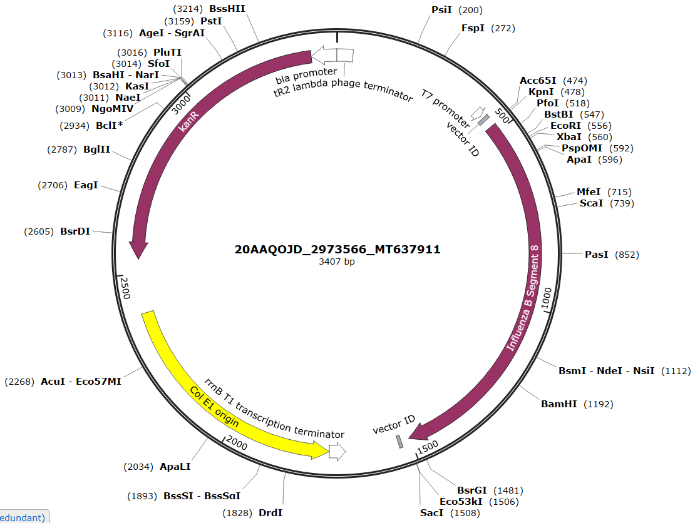
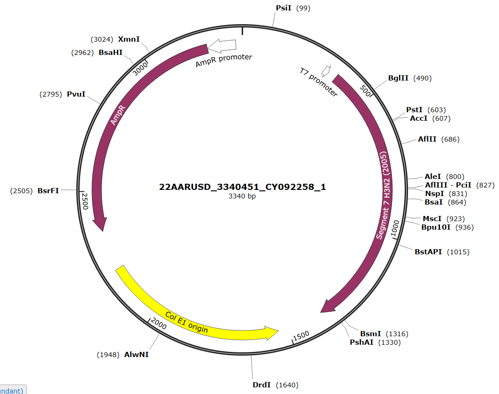
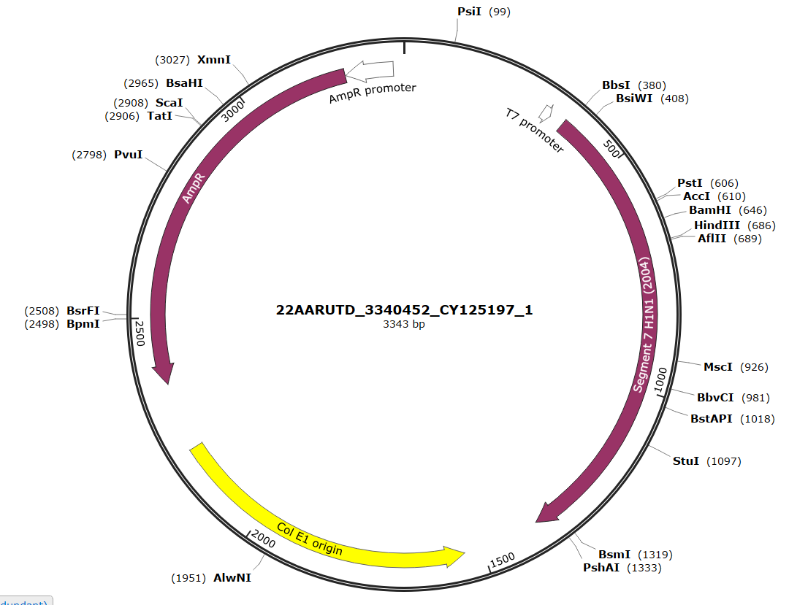
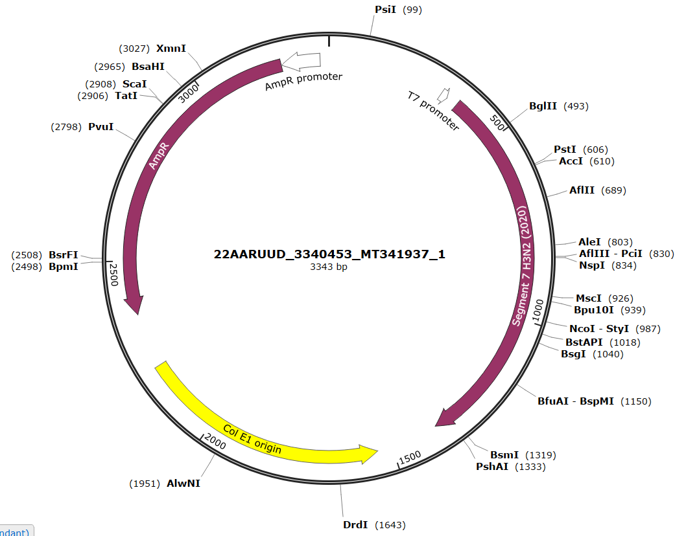
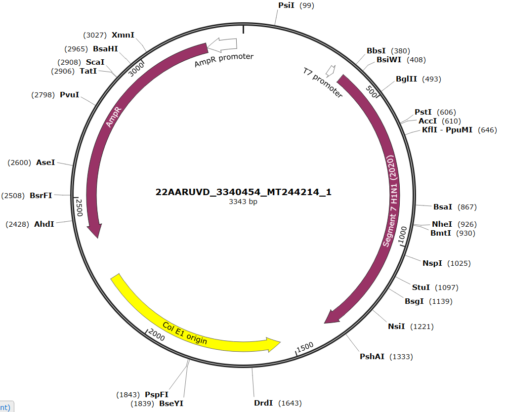

---
output:
  bookdown::pdf_document2:
    fig_caption: yes
    toc: TRUE
    toc_depth: 3
    fontsize: 12pt
    latex_engine: xelatex
bibliography: "Bachelor_quellen.bib"
biblio-style: apalike
citation_package: biblatex
link-citations: yes
urlcolor: RoyalBlue
linkcolor: RoyalBlue
header-includes:
  \usepackage{float}
  \usepackage[ngerman]{babel}
  \usepackage[onehalfspacing]{setspace}
  \usepackage[utf8]{inputenc}
  
---

```{r setup5, include=FALSE}
knitr::opts_chunk$set(echo = FALSE)

library(kableExtra)
library(ggplot2)
library(ggpubr)
library(tidyverse)
library(scales)
library(latex2exp)

```

\pagebreak

# Anhang

(ref:infBobtiam) **Einfluss verschiedener Mischzeitpunkte auf die Influenza B RPA :** normalisierte Fluoreszenzdaten (n=7) der Influenza B RPA bei 10^1^ RNA-Molekülen/µl ohne zusätzlichen Mischschritt (**A**) und mit einem Mischschritt nach 5 Minuten (**B**). Assay im 8tel Ansatz durchgeführt. **C**: normalisierte Fluoreszenzdaten der Influenza B RPA bei verschiedenen Mischzeitpunkten und einer RNA-Ausgangskonzentration von 10^3^ Molekülen/µl. Messung im 8tel Ansatz und in Mehrfachbestimmung (n=6) durchgeführt.

```{r infBobtiam, fig.show='hold', message = FALSE, fig.cap="(ref:infBobtiam)", out.width= "49%", fig.align='center', fig.scap="Etablierung der Influenza B RPA im Original- und 8tel-Ansatz."}


data3 <- read.csv2("daten/V_0064.1.csv")


transformed <- data3 %>% 
  select(Zeit, Probe1, Probe2, Probe3, Probe4, Probe5, Probe6, Probe7, Probe8) %>%
  gather(key = "Proben", value = "Fluoreszenz", -Zeit)

ggplot(transformed, aes(x=Zeit, y = Fluoreszenz)) +
  geom_line(aes(color = Proben)) +
  theme_minimal()+
   ylab("Fluoreszenz in mV")+
   xlab("Zeit in Minuten") +
  ylim(NA,400)+
   scale_color_manual(values = c("#000000", "#fdae61","#fdae61","#fdae61", "#fdae61", "#fdae61", "#fdae61", "#fdae61"))+
  theme(legend.position="none")+
   annotate("text", x=4, y=370, label= "A",col="black", size=12)

data4 <- read.csv2("daten/V_0064.2.csv")


transformed <- data4 %>% 
  select(Zeit, Probe1, Probe2, Probe3, Probe4, Probe5, Probe6, Probe7, Probe8) %>%
  gather(key = "Proben", value = "Fluoreszenz", -Zeit)

ggplot(transformed, aes(x=Zeit, y = Fluoreszenz)) +
  geom_line(aes(color = Proben)) +
  theme_minimal()+
   ylab("Fluoreszenz in mV")+
   xlab("Zeit in Minuten") +
  ylim(NA,400)+
   scale_color_manual(values = c("#000000", "#fdae61","#fdae61","#fdae61", "#fdae61", "#fdae61", "#fdae61", "#fdae61"))+
  theme(legend.position="none")+
  annotate("text", x=4, y=370, label= "B",col="black", size=12)


data1 <- read.csv2("daten/V_0051.ges.csv")


transformed <- data1 %>% 
  select(Zeit, ProbeA, ProbeB, ProbeC, ProbeD, ProbeE, ProbeF, ProbeG, ProbeH, ProbeI,	ProbeJ, ProbeK,	ProbeL,	ProbeM, ProbeN,	ProbeO,	ProbeP,	ProbeQ,	ProbeR,	ProbeS,	ProbeT,	ProbeU) %>%
  gather(key = "Proben", value = "Fluoreszenz", -Zeit)

ggplot(transformed, aes(x=Zeit, y = Fluoreszenz)) +
  geom_line(aes(color = Proben)) +
  theme_minimal()+
   ylab("Fluoreszenz in mV")+
   xlab("Zeit in Minuten") +
   scale_color_manual(values = c("#74add1", "#74add1", "#74add1", "#74add1", "#74add1", "#74add1", "#000000",
                                 "#fee090", "#fee090", "#fee090", "#fee090", "#fee090", "#fee090", "#000000",
                                 "#d73027", "#d73027", "#d73027", "#d73027", "#d73027", "#d73027", "#000000"))+
  theme(legend.position="none")+
  annotate("text", x=4, y=330, label= "C",col="black", size=12)


```


(ref:tab1) Mathematische Daten des TT-Wert Vergleichs für Abbildung \@ref(fig:infBetabl)
```{r tabeins}

tab1 <- read.csv2("daten/tab1.csv", fileEncoding="latin1", header = FALSE)

kable(tab1, booktabs = TRUE, col.names = NULL, format = "latex", escape = FALSE, caption = "(ref:tab1)") %>%
  add_header_above(c("Gruppe 1"= 1, "Gruppe 2"= 1, "Mittelwert Gr. 1"=1, "Mittelwert Gr. 2" =1, "T-Wert"=1, "Freiheitsgrad"=1, "p-wert"=1, "Aussage"=1), line_sep=0) %>%
  kable_styling(latex_options = "hold_position") %>%
  kable_styling(latex_options = "scale_down") %>%
  footnote(general="ns = nicht Signifikant", symbol = c("p = <0.05","p = <0.01", "p = <0.001"), symbol_manual = c('*', '**', '***'), fixed_small_size = TRUE, general_title = "Notiz:", escape= FALSE, footnote_as_chunk =TRUE)
```


(ref:tab2) Mathematische Daten des TT-Wert Vergleichs für Abbildung \@ref(fig:infBoptil)A
(ref:tabbesch) ns = nicht Signifikant; s= signifikant; untr.Konfid. = unteres Konfidenzintervall; obrs.Konfid. = oberes Konfidenzintervall
```{r tabzwei}

tab1 <- read.csv2("daten/tab2.csv", fileEncoding="latin1", header = FALSE)

kable(tab1, booktabs = TRUE, col.names = NULL, format = "latex", escape = FALSE, align = "c", caption = "(ref:tab2)") %>%
  add_header_above(c("Gruppe "= 1, "Werte"= 1, "Mittelwert"=1, "Shapio-Wilk-Test" =1, "Levene-Test"=1, "Anova-Test"=1), line_sep=0) %>%
  pack_rows("Vergleich der Gruppen", 4, 7) %>%
  kable_styling(latex_options = "hold_position") %>%
  kable_styling(latex_options = "scale_down") %>%
  footnote(general="(ref:tabbesch)", symbol = c("p = <0.05","p = <0.01", "p = <0.001"), symbol_manual = c('*', '**', '***'), fixed_small_size = TRUE, general_title = "Notiz:", escape= FALSE, footnote_as_chunk =TRUE, threeparttable = TRUE) %>%
  row_spec(4,hline_after=TRUE)
```


(ref:tab3) Mathematische Daten des TT-Wert Vergleichs für Abbildung \@ref(fig:infBoptil)B
```{r tabdrei}

tab1 <- read.csv2("daten/tab3.csv", fileEncoding="latin1", header = FALSE)

kable(tab1, booktabs = TRUE, col.names = NULL, format = "latex", escape = FALSE, align = "c", caption = "(ref:tab3)") %>%
  add_header_above(c("Gruppe "= 1, "Werte"= 1, "Mittelwert"=1, "Shapio-Wilk-Test" =1, "Levene-Test"=1, "Anova-Test"=1), line_sep=0) %>%
  kable_styling(latex_options = "hold_position") %>%
  kable_styling(latex_options = "scale_down") 
```

(ref:tab4) Mathematische Daten des TT-Wert Vergleichs für Abbildung \@ref(fig:infBobtiam)C

```{r tabvier}

tab1 <- read.csv2("daten/tab4.csv", fileEncoding="latin1", header = FALSE)

kable(tab1, booktabs = TRUE, col.names = NULL, format = "latex", escape = FALSE, align = "c", caption = "(ref:tab4)") %>%
  add_header_above(c("Gruppe "= 1, "Werte"= 1, "Mittelwert"=1, "Shapio-Wilk-Test" =1, "Levene-Test"=1, "Anova-Test"=1), line_sep=0) %>%
  pack_rows("Vergleich der Gruppen", 4, 7) %>%
  kable_styling(latex_options = "hold_position") %>%
  kable_styling(latex_options = "scale_down") %>%
  footnote(general="(ref:tabbesch)", symbol = c("p = <0.05","p = <0.01", "p = <0.001"), symbol_manual = c('*', '**', '***'), fixed_small_size = TRUE, general_title = "Notiz:", escape= FALSE, footnote_as_chunk =TRUE, threeparttable = TRUE) %>%
  row_spec(4,hline_after=TRUE)
```

\pagebreak

\vspace*{2 cm}


```{r plasmidB, fig.align='center',message = FALSE, fig.cap= "\\textbf{Plasmidkarte des Influenza B Plasmides für den Influenza B RNA-Standard}", out.width= "100%", fig.show='hold', fig.scap="Plasmidkarte des Influenza B Plasmides"}




```
\pagebreak

\vspace*{2 cm}


```{r plasmidA258, fig.align='center',message = FALSE, fig.cap= "\\textbf{Plasmidkarte des Influenza A Plasmides für den Influenza H3N2 (2005) RNA-Standard}", out.width= "100%", fig.show='hold', fig.scap="Plasmidkarte des Influenza A Plasmides für den Influenza H3N2 (2005) RNA-Standard"}




```

\pagebreak

\vspace*{2 cm}


```{r plasmidA197, fig.align='center',message = FALSE, fig.cap= "\\textbf{Plasmidkarte des Influenza A Plasmides für den Influenza H1N1 (2004) RNA-Standard}", out.width= "100%", fig.show='hold', fig.scap="Plasmidkarte des Influenza A Plasmides für den Influenza H1N1 (2004) RNA-Standard"}




```

\pagebreak

\vspace*{2 cm}


```{r plasmidA937, fig.align='center',message = FALSE, fig.cap= "\\textbf{Plasmidkarte des Influenza A Plasmides für den Influenza H3N2 (2020) RNA-Standard}", out.width= "100%", fig.show='hold', fig.scap="Plasmidkarte des Influenza A Plasmides für den Influenza H3N2 (2020) RNA-Standard"}




```

\pagebreak

\vspace*{2 cm}


```{r plasmidA214, fig.align='center',message = FALSE, fig.cap= "\\textbf{Plasmidkarte des Influenza A Plasmides für den Influenza H1N1 (2020) RNA-Standard}", out.width= "100%", fig.show='hold', fig.scap="Plasmidkarte des Influenza A Plasmides für den Influenza H1N1 (2020) RNA-Standard"}




```


\pagebreak


