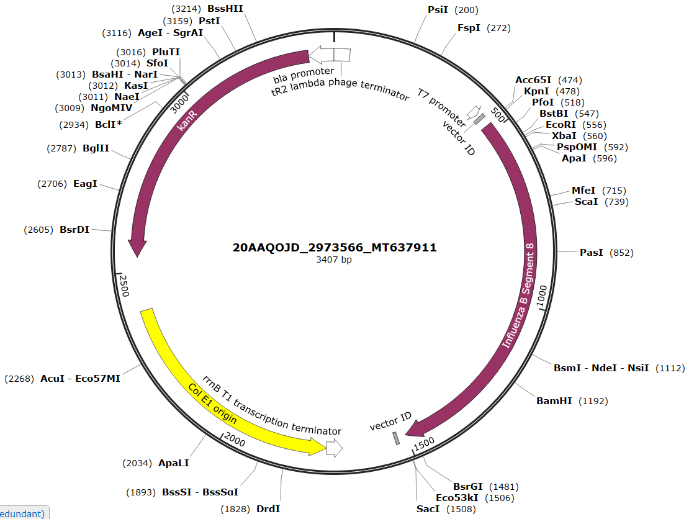
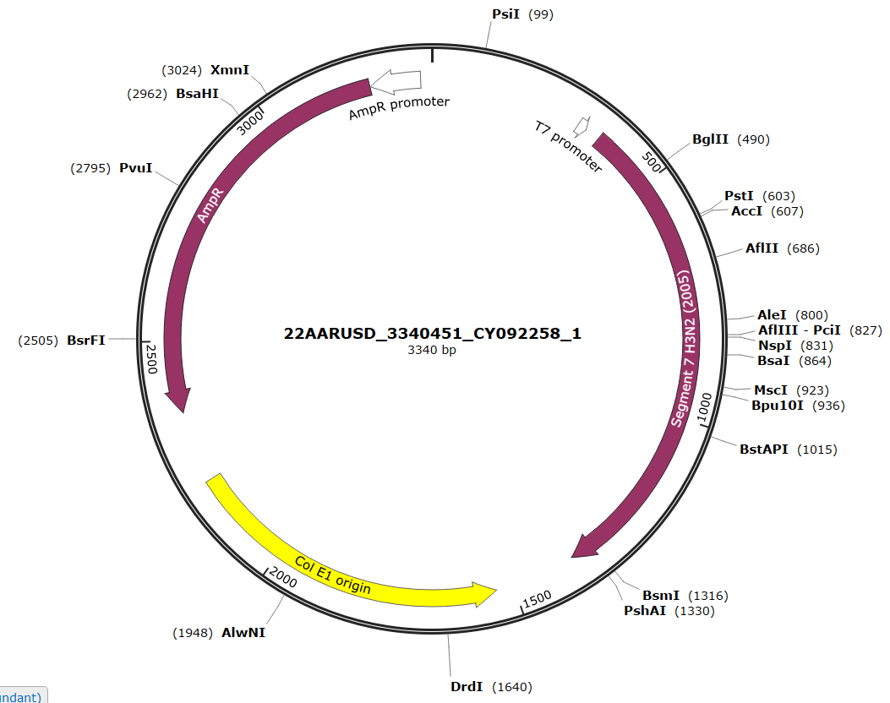
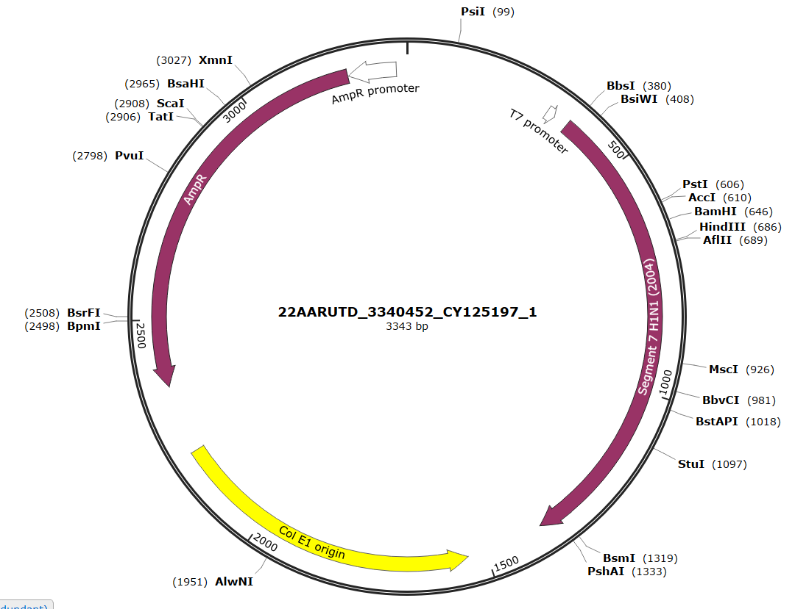
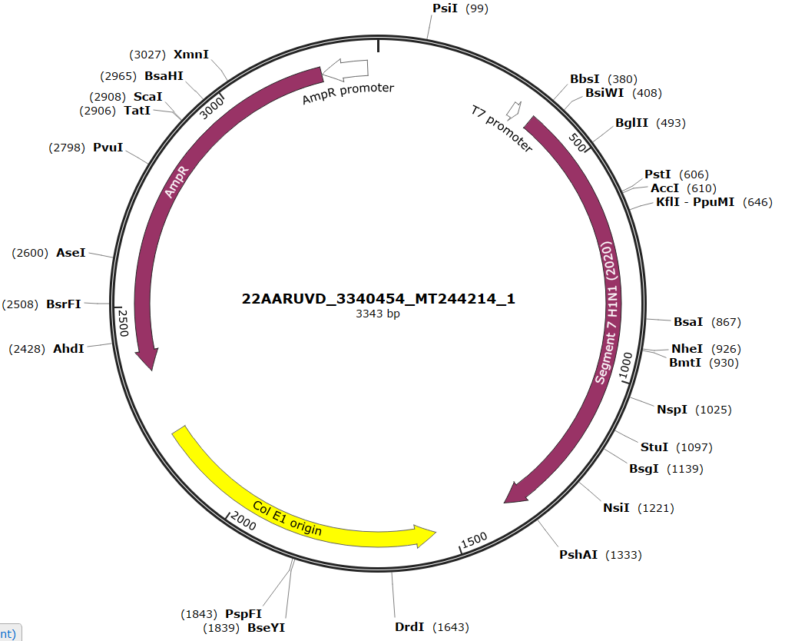

---
output:
  bookdown::pdf_document2:
    fig_caption: yes
    toc: TRUE
    toc_depth: 3
    fontsize: 12pt
    latex_engine: xelatex
bibliography: "Bachelor_quellen.bib"
biblio-style: apalike
citation_package: biblatex
link-citations: yes
urlcolor: RoyalBlue
linkcolor: RoyalBlue
header-includes:
  \usepackage{float}
  \usepackage[ngerman]{babel}
  \usepackage[onehalfspacing]{setspace}
  \usepackage[utf8]{inputenc}
  
---

```{r setup4, include=FALSE}
knitr::opts_chunk$set(echo = FALSE)

library(kableExtra)

```

\pagebreak

# Anhang

\vspace*{2 cm}


```{r plasmidB, fig.align='center',message = FALSE, fig.cap= "\\textbf{Plasmidkarte des Influenza B Plasmides für den Influenza B RNA-Standard}", out.width= "100%", fig.show='hold', fig.scap="Plasmidkarte des Influenza B Plasmides"}




```
\pagebreak

\vspace*{2 cm}


```{r plasmidA258, fig.align='center',message = FALSE, fig.cap= "\\textbf{Plasmidkarte des Influenza A Plasmides für den Influenza H3N2 (2005) RNA-Standard}", out.width= "100%", fig.show='hold', fig.scap="Plasmidkarte des Influenza A Plasmides für den Influenza H3N2 (2005) RNA-Standard"}




```

\pagebreak

\vspace*{2 cm}


```{r plasmidA197, fig.align='center',message = FALSE, fig.cap= "\\textbf{Plasmidkarte des Influenza A Plasmides für den Influenza H1N1 (2004) RNA-Standard}", out.width= "100%", fig.show='hold', fig.scap="Plasmidkarte des Influenza A Plasmides für den Influenza H1N1 (2004) RNA-Standard"}




```

\pagebreak

\vspace*{2 cm}


```{r plasmidA937, fig.align='center',message = FALSE, fig.cap= "\\textbf{Plasmidkarte des Influenza A Plasmides für den Influenza H3N2 (2020) RNA-Standard}", out.width= "100%", fig.show='hold', fig.scap="Plasmidkarte des Influenza A Plasmides für den Influenza H3N2 (2020) RNA-Standard"}

knitr::include_graphics("Bilder/InfA Plasmidkarte 937.PNG")


```

\pagebreak

\vspace*{2 cm}


```{r plasmidA214, fig.align='center',message = FALSE, fig.cap= "\\textbf{Plasmidkarte des Influenza A Plasmides für den Influenza H1N1 (2020) RNA-Standard}", out.width= "100%", fig.show='hold', fig.scap="Plasmidkarte des Influenza A Plasmides für den Influenza H1N1 (2020) RNA-Standard"}




```

\pagebreak