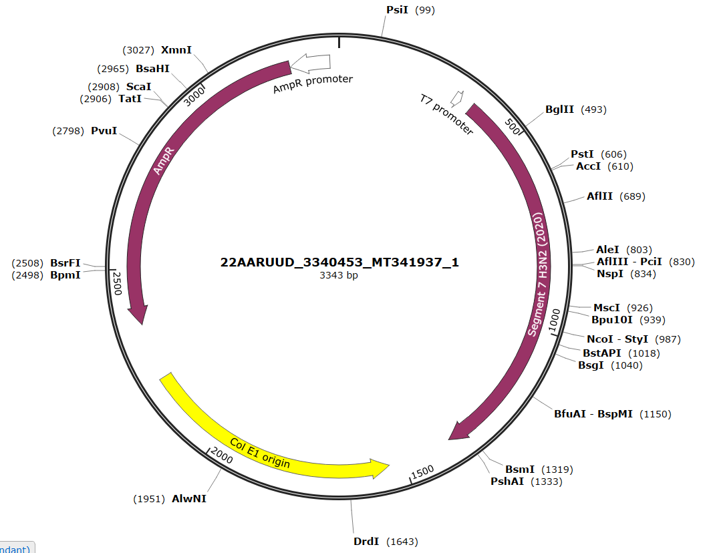

---
output:
  bookdown::pdf_document2:
    fig_caption: yes
    toc: TRUE
    toc_depth: 3
    fontsize: 12pt
    latex_engine: xelatex
bibliography: "Bachelor_quellen.bib"
biblio-style: apalike
citation_package: biblatex
link-citations: yes
urlcolor: RoyalBlue
linkcolor: RoyalBlue
header-includes:
  \usepackage{float}
  \usepackage[ngerman]{babel}
  \usepackage[onehalfspacing]{setspace}
  \usepackage[utf8]{inputenc}
  
---

```{r setup4, include=FALSE}
knitr::opts_chunk$set(echo = FALSE)

library(kableExtra)
library(ggplot2)
library(ggpubr)
library(tidyverse)
library(scales)
library(latex2exp)

```

\pagebreak

# Anhang

\vspace*{2 cm}


```{r plasmidB, fig.align='center',message = FALSE, fig.cap= "\\textbf{Plasmidkarte des Influenza B Plasmides für den Influenza B RNA-Standard}", out.width= "100%", fig.show='hold', fig.scap="Plasmidkarte des Influenza B Plasmides"}


```
\pagebreak

\vspace*{2 cm}


```{r plasmidA258, fig.align='center',message = FALSE, fig.cap= "\\textbf{Plasmidkarte des Influenza A Plasmides für den Influenza H3N2 (2005) RNA-Standard}", out.width= "100%", fig.show='hold', fig.scap="Plasmidkarte des Influenza A Plasmides für den Influenza H3N2 (2005) RNA-Standard"}

knitr::include_graphics("Bilder/InfA Plasmidkarte 258.PNG")


```

\pagebreak

\vspace*{2 cm}


```{r plasmidA197, fig.align='center',message = FALSE, fig.cap= "\\textbf{Plasmidkarte des Influenza A Plasmides für den Influenza H1N1 (2004) RNA-Standard}", out.width= "100%", fig.show='hold', fig.scap="Plasmidkarte des Influenza A Plasmides für den Influenza H1N1 (2004) RNA-Standard"}


```

\pagebreak

\vspace*{2 cm}


```{r plasmidA937, fig.align='center',message = FALSE, fig.cap= "\\textbf{Plasmidkarte des Influenza A Plasmides für den Influenza H3N2 (2020) RNA-Standard}", out.width= "100%", fig.show='hold', fig.scap="Plasmidkarte des Influenza A Plasmides für den Influenza H3N2 (2020) RNA-Standard"}




```

\pagebreak

\vspace*{2 cm}


```{r plasmidA214, fig.align='center',message = FALSE, fig.cap= "\\textbf{Plasmidkarte des Influenza A Plasmides für den Influenza H1N1 (2020) RNA-Standard}", out.width= "100%", fig.show='hold', fig.scap="Plasmidkarte des Influenza A Plasmides für den Influenza H1N1 (2020) RNA-Standard"}


```


\pagebreak

```{r infBobtia, fig.show='hold', message = FALSE, fig.cap="a", out.width= "49%", fig.align='center', fig.scap="Etablierung der Influenza B RPA im Original- und 8tel-Ansatz."}

data1 <- read.csv2("daten/V_0051.ges.csv")


transformed <- data1 %>% 
  select(Zeit, ProbeA, ProbeB, ProbeC, ProbeD, ProbeE, ProbeF, ProbeG, ProbeH, ProbeI,	ProbeJ, ProbeK,	ProbeL,	ProbeM, ProbeN,	ProbeO,	ProbeP,	ProbeQ,	ProbeR,	ProbeS,	ProbeT,	ProbeU) %>%
  gather(key = "Proben", value = "Fluoreszenz", -Zeit)

ggplot(transformed, aes(x=Zeit, y = Fluoreszenz)) +
  geom_line(aes(color = Proben)) +
  theme_minimal()+
   ylab("Fluoreszenz in mV")+
   xlab("Zeit in Minuten") +
   scale_color_manual(values = c("#74add1", "#74add1", "#74add1", "#74add1", "#74add1", "#74add1", "#000000",
                                 "#fee090", "#fee090", "#fee090", "#fee090", "#fee090", "#fee090", "#000000",
                                 "#d73027", "#d73027", "#d73027", "#d73027", "#d73027", "#d73027", "#000000"))+
  theme(legend.position="none")+
  annotate("text", x=4, y=330, label= "A",col="black", size=12)


data2 <- read.csv2("daten/V_0063.csv")


transformed <- data2 %>% 
  select(Zeit, ProbeA, ProbeB, ProbeC, ProbeD, ProbeE, ProbeF, ProbeG, ProbeH, ProbeI,	ProbeJ, ProbeK,	ProbeL,	ProbeM, ProbeN,	ProbeO,	ProbeP) %>%
  gather(key = "Proben", value = "Fluoreszenz", -Zeit)

ggplot(transformed, aes(x=Zeit, y = Fluoreszenz)) +
  geom_line(aes(color = Proben)) +
  theme_minimal()+
   ylab("Fluoreszenz in mV")+
   xlab("Zeit in Minuten") +
   scale_color_manual(values = c("#000000", "#abd9e9", "#abd9e9", "#abd9e9", "#abd9e9", "#abd9e9", "#abd9e9","#abd9e9",
                                 "#000000", "#fdae61", "#fdae61", "#fdae61", "#fdae61", "#fdae61", "#fdae61","#fdae61" ))+
  theme(legend.position="none")+
  annotate("text", x=4, y=330, label= "B",col="black", size=12)


data3 <- read.csv2("daten/V_0064.1.csv")


transformed <- data3 %>% 
  select(Zeit, Probe1, Probe2, Probe3, Probe4, Probe5, Probe6, Probe7, Probe8) %>%
  gather(key = "Proben", value = "Fluoreszenz", -Zeit)

ggplot(transformed, aes(x=Zeit, y = Fluoreszenz)) +
  geom_line(aes(color = Proben)) +
  theme_minimal()+
   ylab("Fluoreszenz in mV")+
   xlab("Zeit in Minuten") +
  ylim(NA,400)+
   scale_color_manual(values = c("#000000", "#fdae61","#fdae61","#fdae61", "#fdae61", "#fdae61", "#fdae61", "#fdae61"))+
  theme(legend.position="none")+
   annotate("text", x=4, y=370, label= "C",col="black", size=12)

data4 <- read.csv2("daten/V_0064.2.csv")


transformed <- data4 %>% 
  select(Zeit, Probe1, Probe2, Probe3, Probe4, Probe5, Probe6, Probe7, Probe8) %>%
  gather(key = "Proben", value = "Fluoreszenz", -Zeit)

ggplot(transformed, aes(x=Zeit, y = Fluoreszenz)) +
  geom_line(aes(color = Proben)) +
  theme_minimal()+
   ylab("Fluoreszenz in mV")+
   xlab("Zeit in Minuten") +
  ylim(NA,400)+
   scale_color_manual(values = c("#000000", "#fdae61","#fdae61","#fdae61", "#fdae61", "#fdae61", "#fdae61", "#fdae61"))+
  theme(legend.position="none")+
  annotate("text", x=4, y=370, label= "D",col="black", size=12)


```


