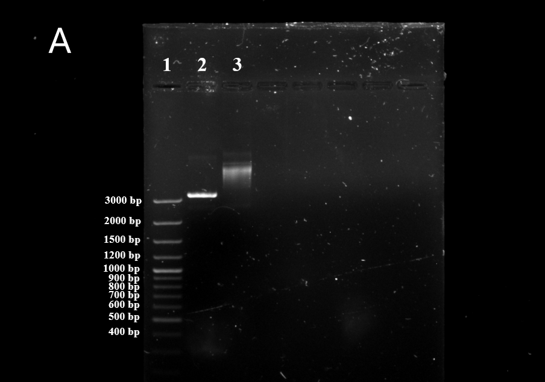

---
output:
  bookdown::pdf_document2:
    fig_caption: yes
    toc: TRUE
    toc_depth: 3
    fontsize: 12pt
    latex_engine: xelatex
bibliography: "Bachelor_quellen.bib"
biblio-style: apalike
citation_package: biblatex
link-citations: yes
urlcolor: RoyalBlue
linkcolor: RoyalBlue
header-includes:
  \usepackage{float}
  \usepackage[ngerman]{babel}
  \usepackage[onehalfspacing]{setspace}
  \usepackage[utf8]{inputenc}
  
---

```{r setup2, include=FALSE}
knitr::opts_chunk$set(echo = FALSE)

library(kableExtra)
library(ggplot2)
library(ggpubr)
library(tidyverse)
library(scales)


```

# Ergebnisse

## Entwicklung einer RPA-Nachweissystems für Influenza B

kleiner Einleitungstext....

### RPA-Primerdesing für das Influenza B Virus

Für das Influenza B Virus konnten nach der beschriebenen Methode (siehe \@ref(desing)) isngesamt 10 verschiedene Primer-Sonden-Kombinationen gefunden werden. Davon befanden sich 2 Kombinationen im Bereich zwischen 625-756 Basenpaare und 8 im Bereich von 443-615 Basenpaare. Diese wurden in einer Dreifachbestimmung (n=3) nach Methode \@ref(RPAnormal) getestet. Dabei zeigte das Primer-Sonden-Paar, welches in Tabelle \@ref(tab:RPAoligo) beschrieben ist, die besten Ergebnisse. Dieses Primer-Sonden-Paar wurde für alle weiteren Rekombinase Polymerase Ampflifikationen innerhalb dieses Abschnitts verwendet. Der Amplifikationsbereich liegt dabei zwischen 625 bp und 749 bp.

### Herstellung der Influenza B Virus Standard-RNA{#standardherstellungb}

Um verschiedene Nukleinsäure-Amplifikationsverfahren durchführen zu können, war es nötig standartisierte Virus-RNA mit einer definierten Konzentration her zu stellen. Dabei diente ein DNA-Plasmid mit der entsprechenden Virus-Sequenz als Ausgangsmaterial. Dieses wurde in _E. coli_ transfomiert, durch Kultivierung vermehrt und anschließend mittels verschiedener Methoden zur gewünschten Virus-RNA transkribiert. 

Da für das Influenza B Virus innerhalb der Arbeitsgruppe schon eine transformierte Bakterienkolonie vorhanden war, konnte direkt eine Kultivierung (siehe Kapitel \@ref(kultivierung)) mit anschließender Plasmid-Extraktion nach beschriebener Methode (siehe Kapitel \@ref(isolation)) erfolgen. Dabei konnten 30 µl Plasmid-DNA-Lösung mit einer Konzentration von ~1616 ng/µl mit einem 260nm/280nm Verhältnis von 1,90 gewonnen werden. Durch die Sequenzierung (siehe \@ref(sequenzierung)) konnte die richtige Orientierung der DNA festgestellt und mögliche Sequenzfehler ausgeschlossen werden.

Der anschließende Restriktionsverdau (siehe Kapitel (\@ref(verdau)) diente dazu, das Plasmid zu linearisieren und somit für die in vitro Transkription vorzubereiten. Das Kontrollgel, durchgeführt nach beschriebener Methode (siehe Kapitel \@ref(gel)) ist in Abbildung \@ref(fig:infBverdau) gezeigt. Die darin enthaltenen DNA-Banden zeigen unterschiedliche größen, wobei das verdaute Plasmid deutlich unter dem unverdautem Kontorllplasmid liegt. Um mit der verdauten DNA weiterzuarbeiten mussten Puffer und Enzymrückstände vom Restriktionsverdau entfernt werden. Dazu wurde der Restriktionsansatz nach beschriebener Methode (siehe Kapitel \@ref(cleaning)) gereinigt. Es konnten dabei 10 µl einer ~146,6 ng/µl DNA-LÖsung mit einem 260nm/280nm Verhältnis von 1,89 gewonnen werden. 


```{r infBverdau, fig.align='center',message = FALSE, fig.cap= "\\textbf{Kontrollgel und Ribogreen Kalibrationsgerade der Influenza B Standardherstellung:} \\textbf{A:} DNA-Banden des Kontrollgels für den Restriktionsverdau des Influenza B Plasmids mit verdautem Plasmid (2), unverdautem Kontrollplasmid (3) und mitgeführter DNA-Leiter (1). Das linearisierte Plasmid läuft bei ca. 3300 bp und somit unter dem mitgeführten ungeschnittenem Kontrollplasmid. Das Kontrollplasmid zeigt keine klare Bande. Bild ist digital bearbeitet. \\textbf{B:} Kalibrationsgerade des Ribogreen-Assays mit angefügter Geradengleichung, Korrelationskoeffizienten und p-Wert. Das graue Band zeigt das 95 \\%ige Konfidenzintervall der linearen Funktion. Alle Messungen wurden mit n=4 durchgeführt. ", out.width= "49%", fig.show='hold', fig.scap="Kontrollgel und Ribogreen Kalibrationsgerade der Influenza B Standardherstellung"}




data <- read.csv2("Daten/V_0027.csv")

ggplot(data, aes(konz, fluo)) +
  geom_point() +
  geom_smooth(method = "lm") +
  theme_minimal()+
   ylab("Fluoreszenz")+
   xlab("Konzentration") +
  stat_cor(label.y = 2700)+ 
        stat_regline_equation(label.y = 2400)+ 
  annotate(geom="text", x=10, y=3500, label="B", color="black", size=12)


```

Die Herstellung der RNA wurde wie in Kapitel \@ref(transkription) beschrieben durchgeführt und im Anschluss mit dem Ribogreen-Assay nach beschriebener Methode (siehe Kapitel \@ref(ribogreen)) quanitifiziert. Die Kalibrationsgerade des Assays ist in Abbildung \@ref(fig:infBverdau) gezeigt. Die Kalibrierung ergab eine Geradengleichung von $y=22+3,6x$ mit einem Korrelationskoeffizient R = 0.99. Anhand dieser Geradengleichung konnte die Hergestellte RNA in einer Fünffachbestimmung (n=5) quantifiziert werden. Der Influenza B Virus RNA-Standard besitzt eine KOnzentration von $476.0 \pm 7,8$ ng/ml und eine Kopienzahl von $2,17 *10^8$ Kopien/µl.

### Ermittlung der Sesitivität der Influenza B PCR

Zur Überprüfung der Sensitivität und um ein etabliertes Amplifikationsystem zum Vergleich heranziehen zu können, wurde das in Kaptiel \@ref(infbPCR) gezeigte PCR-System auf die Sesitivität getestet. Dazu wurde der in \@ref(standardherstellungb) hergestellte Standard auf $2*10^7$ Kopien/µl verdünnt und in \textcolor{red}{dekadischen Verdünnungsstufen} bis zu $2*10^0$ in jeweils einer Mehrfachbestimmung (n=7) auf eine Amplifikation nach beschriebener Methode \@ref(infbPCR) getestet. Die Amplifikationsgraphen sowie der lineare Zusammenhang der Ct-Werte (ermittelt nach der in \@ref(chipPCR) beschriebenen Methode) sind in Abbildung \@ref() gezeigt. Zur Ermittlung der Sesitivät wurde die in Kapitel \@ref(probit) beschriebene Methode verwendet. Es konnte ein 95 %-iges Detektionslimit von 11,4 Kopien/µl, gezeigt in Abbildung \@ref()C, bestimmt werden.

```{r Conawachstum, fig.show='hold', fig.cap="\\textbf{Sensitivitätsanalyse der Influenza B PCR:} \\textbf{A:} Amplifikationsgraphen der Influenza B PCR bei verschiedenen Konzentrationen (n=7). \\textbf{B:} Linearer Zusammenhang der Ct-Werte mit angefügter Geradengleichung, Korrelationskoeffizienten und p-Wert. Das graue Band zeigt das 95 \\%ige Konfidenzintervall der linearen Funktion. Gezeigt sind nur Ct-Werte, welche einer positiven Amplifikation zugehörig sind. \\textbf{C:} Probit-Analyse der Amplifikationsdaten. Die ermittelte Sensitivitätsgrenze, bei welcher 95 \\% der Amplifikationen positiv sind, liegt bei 11,3 Molekülen.", out.width= "49%", fig.align='center', fig.scap="Sensitivitätsanalyse der Influenza B PCR"}

data <- read.csv2("Daten/V_0096.probit.csv")

zehn7 <- data %>% 
  select(Zeit, X1071,	X1072,	X1073,	X1074,	X1075,	X1076,	X1077) %>%
  gather(key = "Proben", value = "Fluoreszenz", -Zeit)

zehn6 <- data %>% 
  select(Zeit, X1061,	X1062,	X1063,	X1064,	X1065,	X1066,	X1067) %>%
  gather(key = "Proben", value = "Fluoreszenz", -Zeit)

zehn5 <- data %>% 
  select(Zeit,  X1051,	X1052,	X1053,	X1054,	X1055,	X1056,	X1057) %>%
  gather(key = "Proben", value = "Fluoreszenz", -Zeit)

zehn4 <- data %>% 
  select(Zeit, X1041,	X1042,	X1043,	X1044,	X1045,	X1046,	X1047) %>%
  gather(key = "Proben", value = "Fluoreszenz", -Zeit)

zehn3 <- data %>% 
  select(Zeit, X1031,	X1032,	X1033,	X1034,	X1035,	X1036,	X1037) %>%
  gather(key = "Proben", value = "Fluoreszenz", -Zeit)

zehn2 <- data %>% 
  select(Zeit, X1021,	X1022,	X1023,	X1024,	X1025,	X1026,	X1027) %>%
  gather(key = "Proben", value = "Fluoreszenz", -Zeit)

zehn1 <- data %>% 
  select(Zeit,	X1011,	X1012,	X1013,	X1014,	X1015,	X1016,	X1017) %>%
  gather(key = "Proben", value = "Fluoreszenz", -Zeit)

zehn0 <- data %>% 
  select(Zeit, X1001,	X1002,	X1003,	X1004,	X1005,	X1006,	X1007) %>%
  gather(key = "Proben", value = "Fluoreszenz", -Zeit)

zehnnk <- data %>%
  select(Zeit, nk1,	nk2,	nk3,	nk4,	nk5,	nk6,	nk7,	nk8) %>%
  gather(key = "Proben", value = "Fluoreszenz", -Zeit)
  
transformed <- rbind(zehn7, zehn6, zehn5, zehn4, zehn3, zehn2, zehn1, zehn0, zehnnk)


ggplot(transformed, aes(x=Zeit, y = Fluoreszenz)) +
  geom_line(aes(color = Proben), size = 0.3) +
  theme_minimal()+
   ylab("Fluoreszenz in mV")+
   xlab("Zyklus")+
  scale_color_manual(values = c("#d73027", "#d73027", "#d73027", "#d73027", "#d73027", "#d73027", "#d73027", "#d73027", 
                                "#f46d43", "#f46d43", "#f46d43", "#f46d43", "#f46d43", "#f46d43", "#f46d43",  
                                "#fdae61", "#fdae61", "#fdae61", "#fdae61", "#fdae61", "#fdae61", "#fdae61",  
                                "#fee090", "#fee090", "#fee090", "#fee090", "#fee090", "#fee090", "#fee090",  
                                "#e0f3f8", "#e0f3f8", "#e0f3f8", "#e0f3f8", "#e0f3f8", "#e0f3f8", "#e0f3f8",  
                                "#abd9e9", "#abd9e9", "#abd9e9", "#abd9e9", "#abd9e9", "#abd9e9", "#abd9e9",  
                                "#74add1", "#74add1", "#74add1", "#74add1", "#74add1", "#74add1", "#74add1",  
                                "#4575b4", "#4575b4", "#4575b4", "#4575b4", "#4575b4", "#4575b4", "#4575b4",
                                "#333388", "#333388", "#333388", "#333388", "#333388", "#333388", "#333388"))+
  theme(legend.position="none")+
  annotate(geom="text", x=3, y=6, label="A", color="black", size=12)
   
data <- read.csv2("Daten/regression.csv")


ggplot(data, aes(konz, ct)) +
  geom_point() +
  geom_smooth(method = "lm") +
  theme_minimal()+
   ylab("Ct-Wert")+
   xlab("Konzentration") +
  scale_x_log10(breaks = trans_breaks('log10', function(x) 10^x),
                  labels = trans_format('log10', math_format(10^.x)))+
  stat_cor(label.y = 28)+ 
        stat_regline_equation(label.y = 25)+
  annotate(geom="text", x=1000000, y=35, label="B", color="black", size=12)

knitr::include_graphics("Bilder/infB_probit.png")

#Zitation: Sktript entwickelt von Ole Bährmann, beschrieben durch (quelle vom Coronapaper), modifiziert und an meine Daten angespasst durch mich
   
```


Zur Ermittlung der Sesitivät wurde die in Kapitel \@ref(probit) beschriebene Methode verwendet. Es konnte ein 95 %-iges Detektionslimit von 11,4 Kopien/µl bestimmt werden. 
 
