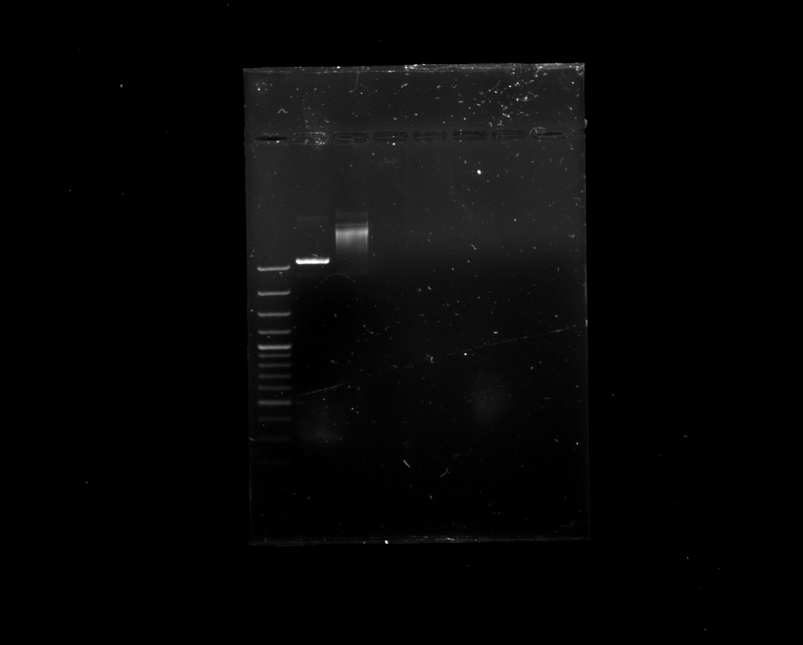

---
output:
  bookdown::pdf_document2:
    fig_caption: yes
    toc: TRUE
    toc_depth: 3
    fontsize: 12pt
    latex_engine: xelatex
bibliography: "Bachelor_quellen.bib"
biblio-style: apalike
citation_package: biblatex
link-citations: yes
urlcolor: RoyalBlue
linkcolor: RoyalBlue
header-includes:
  \usepackage{float}
  \usepackage[ngerman]{babel}
  \usepackage[onehalfspacing]{setspace}
  \usepackage[utf8]{inputenc}
  
---

```{r setup2, include=FALSE}
knitr::opts_chunk$set(echo = FALSE)

library(kableExtra)

```

# Ergebnisse

## Entwicklung einer RPA-Nachweissystems für Influenza B

kleiner Einleitungstext....

### RPA-Primerdesing für das Influenza B Virus

Für das Influenza B Virus konnten nach der beschriebenen Methode (siehe \@ref(desing)) isngesamt 10 verschiedene Primer-Sonden-Kombinationen gefunden werden. Davon befanden sich 2 Kombinationen im Bereich zwischen 625-756 Basenpaare und 8 im Bereich von 443-615 Basenpaare. Diese wurden in einer Dreifachbestimmung (n=3) nach Methode \@ref(RPAnormal) getestet. Dabei zeigte das Primer-Sonden-Paar, welches in Tabelle \@ref(tab:RPAoligo) beschrieben ist, die besten Ergebnisse. Dieses Primer-Sonden-Paar wurde für alle weiteren Rekombinase Polymerase Ampflifikationen innerhalb dieses Abschnitts verwendet. Der Amplifikationsbereich liegt dabei zwischen 625 bp und 749 bp.

### Herstellung der Influenza B Virus Standard-RNA

Um verschiedene Nukleinsäure-Amplifikationsverfahren durchführen zu können, war es nötig standartisierte Virus-RNA mit einer definierten Konzentration her zu stellen. Dabei diente ein DNA-Plasmid mit der entsprechenden Virus-Sequenz als Ausgangsmaterial. Dieses wurde in _E. coli_ transfomiert, durch Kultivierung vermehrt und anschließend mittels verschiedener Methoden zur gewünschten Virus-RNA transkribiert. 

Da für das Influenza B Virus innerhalb der Arbeitsgruppe schon eine transformierte Bakterienkolonie vorhanden war, konnte direkt eine Kultivierung (siehe Kapitel \@ref(kultivierung)) mit anschließender Plasmid-Extraktion nach beschriebener Methode (siehe Kapitel \@ref(isolation)) erfolgen. Dabei konnten 30 µl Plasmid-DNA-Lösung mit einer Konzentration von ~1616 ng/µl mit einem 260nm/280nm Verhältnis von 1,90 gewonnen werden. Durch die Sequenzierung (siehe \@ref(sequenzierung)) konnte die richtige Orientierung der DNA festgestellt und mögliche Sequenzfehler ausgeschlossen werden.

Der anschließende Restriktionsverdau (siehe Kapitel (\@ref(verdau)) diente dazu, das Plasmid zu linearisieren und somit für die in vitro Transkription vorzubereiten. Das Kontrollgel, durchgeführt nach beschriebener Methode (siehe Kapitel \@ref) ist in Abbildung \@ref(fig:infBverdau)

```{r infBverdau, fig.align='center', fig.cap= "\\textbf{Kontrollgel des Influenza B Restriktionsverdaus:} DNA-Banden des Kontrollgels für den Restriktionsverdau des Influenza B Plasmids mit verdautem Plasmid (2), unverdautem Kontrollplasmid (3) und mitgeführter DNA-Leiter (1). Das linearisierte Plasmid läuft bei ca. 3300 bp und somit unter dem mitgeführten ungeschnittenem Kontrollplasmid. Das Kontrollplasmid zeigt keine klare Bande. Bild ist digital bearbeitet.", out.width= "55%", fig.show='hold', fig.scap="Kontrollgel des Influenza B Restriktionsverdaus"}


```


\pagebreak


# Literaturverzeichnis
