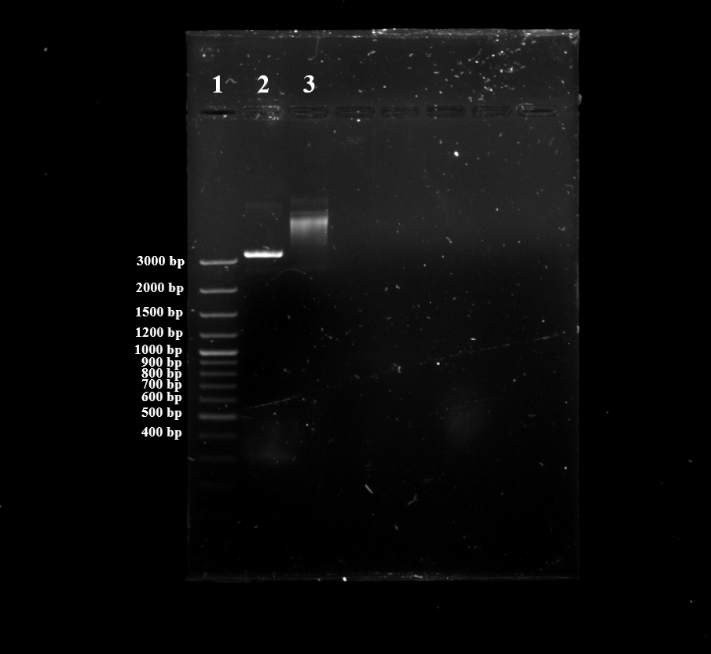

---
output:
  bookdown::pdf_document2:
    fig_caption: yes
    toc: TRUE
    toc_depth: 3
    fontsize: 12pt
    latex_engine: xelatex
bibliography: "Bachelor_quellen.bib"
biblio-style: apalike
citation_package: biblatex
link-citations: yes
urlcolor: RoyalBlue
linkcolor: RoyalBlue
header-includes:
  \usepackage{float}
  \usepackage[ngerman]{babel}
  \usepackage[onehalfspacing]{setspace}
  \usepackage[utf8]{inputenc}
  
---

```{r setup2, include=FALSE}
knitr::opts_chunk$set(echo = FALSE)

library(kableExtra)

```

# Ergebnisse

## Entwicklung einer RPA-Nachweissystems für Influenza B

kleiner Einleitungstext....

### RPA-Primerdesing für das Influenza B Virus

Für das Influenza B Virus konnten nach der beschriebenen Methode (siehe \@ref(desing)) isngesamt 10 verschiedene Primer-Sonden-Kombinationen gefunden werden. Davon befanden sich 2 Kombinationen im Bereich zwischen 625-756 Basenpaare und 8 im Bereich von 443-615 Basenpaare. Diese wurden in einer Dreifachbestimmung (n=3) nach Methode \@ref(RPAnormal) getestet. Dabei zeigte das Primer-Sonden-Paar, welches in Tabelle \@ref(tab:RPAoligo) beschrieben ist, die besten Ergebnisse. Dieses Primer-Sonden-Paar wurde für alle weiteren Rekombinase Polymerase Ampflifikationen innerhalb dieses Abschnitts verwendet. Der Amplifikationsbereich liegt dabei zwischen 625 bp und 749 bp.

### Herstellung der Influenza B Virus Standard-RNA

Um verschiedene Nukleinsäure-Amplifikationsverfahren durchführen zu können, war es nötig standartisierte Virus-RNA mit einer definierten Konzentration her zu stellen. Dabei diente ein DNA-Plasmid mit der entsprechenden Virus-Sequenz als Ausgangsmaterial. Dieses wurde in _E. coli_ transfomiert, durch Kultivierung vermehrt und anschließend mittels verschiedener Methoden zur gewünschten Virus-RNA transkribiert. 

Da für das Influenza B Virus innerhalb der Arbeitsgruppe schon eine transformierte Bakterienkolonie vorhanden war, konnte direkt eine Kultivierung (siehe Kapitel \@ref(kultivierung)) mit anschließender Plasmid-Extraktion nach beschriebener Methode (siehe Kapitel \@(isolation)) erfolgen. Dabei konnten 30 µl Plasmid-DNA-Lösung mit einer Konzentration von ~1616 ng/µl mit einem 260nm/280nm Verhältnis von 1,90 gewonnen werden. Durch die Sequenzierung (siehe \@ref(sequenzierung)) konnte die richtige Orientierung der DNA festgestellt und mögliche Sequenzfehler ausgeschlossen werden.

Der anschließende Restriktionsverdau (siehe Kapitel (\@ref(verdau)) diente dazu, das Plasmid zu linearisieren und somit für die in vitro Transkription vorzubereiten. Das Kontrollgel, durchgeführt nach beschriebener Methode (siehe Kapitel \@ref) ist in Abbildung \@ref(fig:infBverdau)

```{r infBverdau, fig.align='center', fig.cap= "\\textbf{Auswertung des Primertests mit der MCE MultiNA:} PCR-Banden von den PCR-Produkten der Positivkontrollen (A) und Negtivkontrollen (B) des Primertests mit angefügter DNA-Leiter. Die Primerpaare zeigen bei den Positivkontrollen in zwei von drei Fällen eine Bande. Ausnahme ist das Primerpaar Alkanibacter Var. 2, welches nur eine Bande bei den Positivkontrollen aufwies. Bei dem Negativkontrollen ist eine Bande bei dem \\textit{Chujaibacter}-Primerpaar und jeweils eine schwache Bande für beide \\textit{Halothiobacillus}-Primerpaare zu erkennen. Proben wurden mit dem DNA 1000 Programm der MCE MultiNA ausgewertet.", out.width= "65%", fig.show='hold', fig.scap="Auswertung des Primertests mit der MCE MultiNA"}


```


\pagebreak


# Literaturverzeichnis
