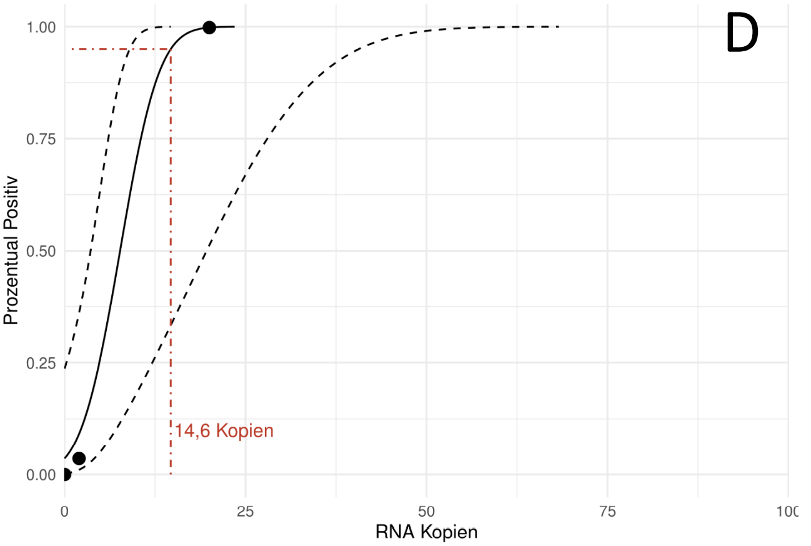

---
output:
  bookdown::pdf_document2:
    fig_caption: yes
    toc: TRUE
    toc_depth: 3
    fontsize: 12pt
    latex_engine: xelatex
bibliography: "Bachelor_quellen.bib"
biblio-style: apalike
citation_package: biblatex
link-citations: yes
urlcolor: RoyalBlue
linkcolor: RoyalBlue
header-includes:
  \usepackage{float}
  \usepackage[ngerman]{babel}
  \usepackage[onehalfspacing]{setspace}
  \usepackage[utf8]{inputenc}
  
---

```{r setup2, include=FALSE}
knitr::opts_chunk$set(echo = FALSE)

library(kableExtra)
library(ggplot2)
library(ggpubr)
library(tidyverse)
library(scales)
library(latex2exp)


```

# Ergebnisse

## Entwicklung eines Rekombinase Polymerase Amplifikationssystems für das Influenza B Virus

kleiner Einleitungstext....

### Rekombinase Polymerase Amplifikation-Primerdesing für das Influenza B Virus{#eprimer}

Für das Influenza B Virus konnten nach der beschriebenen Methode (siehe \@ref(desing)) isngesamt 10 verschiedene Primer-Sonden-Kombinationen gefunden werden. Davon befanden sich 2 Kombinationen im Bereich zwischen 625-756 Basenpaare und 8 im Bereich von 443-615 Basenpaare. Diese wurden in einer Dreifachbestimmung (n=3) nach Methode \@ref(RPAnormal) getestet. Dabei zeigte das Primer-Sonden-Paar, welches in Tabelle \@ref(tab:RPAoligo) beschrieben ist, die besten Ergebnisse. Dieses Primer-Sonden-Set wurde für alle weiteren Rekombinase Polymerase Ampflifikationen innerhalb dieses Abschnitts verwendet. Der Amplifikationsbereich liegt dabei zwischen 625 bp und 749 bp.

### Herstellung der Influenza B Virus Standard-RNA {#standardherstellung}

Um verschiedene Nukleinsäure-Amplifikationsverfahren durchführen zu können, war es nötig standartisierte Virus-RNA mit einer definierten Konzentration her zu stellen. Dabei diente ein DNA-Plasmid mit der entsprechenden Virus-Sequenz als Ausgangsmaterial. Dieses wurde in _E. coli_ transfomiert, durch Kultivierung vermehrt und anschließend mittels verschiedener Methoden zur gewünschten Virus-RNA transkribiert. 

Da für das Influenza B Virus innerhalb der Arbeitsgruppe schon eine transformierte Bakterienkolonie vorhanden war, konnte direkt eine Kultivierung (siehe Kapitel \@ref(kultivierung)) mit anschließender Plasmid-Extraktion nach beschriebener Methode (siehe Kapitel \@ref(isolation)) erfolgen. Durch eine Sequenzierung (siehe \@ref(sequenzierung)) konnten mögliche Sequenzfehler der extrahierten DNA ausgeschlossen werden.

Der anschließende Restriktionsverdau (siehe Kapitel (\@ref(verdau)) diente dazu, das Plasmid zu linearisieren und somit für die in vitro Transkription vorzubereiten. Das Kontrollgel, durchgeführt nach beschriebener Methode (siehe Kapitel \@ref(gel)) ist in Abbildung \@ref(fig:infBverdau) gezeigt. Die darin enthaltenen DNA-Banden zeigen unterschiedliche größen, wobei das verdaute Plasmid deutlich unter dem unverdautem Kontorllplasmid liegt. Um mit der verdauten DNA weiterzuarbeiten mussten Puffer und Enzymrückstände vom Restriktionsverdau entfernt werden. Dazu wurde der Restriktionsansatz nach beschriebener Methode (siehe Kapitel \@ref(cleaning)) gereinigt.


```{r infBverdau, fig.align='center',message = FALSE, fig.cap= "\\textbf{Kontrollgel und Ribogreen Kalibrationsgerade der Influenza B Standardherstellung:} \\textbf{A:} DNA-Banden des Kontrollgels für den Restriktionsverdau des Influenza B Plasmids mit verdautem Plasmid (2), unverdautem Kontrollplasmid (3) und mitgeführter DNA-Leiter (1). Das linearisierte Plasmid läuft bei ca. 3300 bp und somit unter dem mitgeführten ungeschnittenem Kontrollplasmid. Das Kontrollplasmid zeigt keine klare Bande. Bild ist digital bearbeitet. \\textbf{B:} Kalibrationsgerade des Ribogreen-Assays mit angefügter Geradengleichung, Korrelationskoeffizienten und p-Wert. Das graue Band zeigt das 95 \\%ige Konfidenzintervall der linearen Funktion. Alle Messungen wurden mit n=4 durchgeführt. ", out.width= "49%", fig.show='hold', fig.scap="Kontrollgel und Ribogreen Kalibrationsgerade der Influenza B Standardherstellung"}


data <- read.csv2("Daten/V_0027.csv")

ggplot(data, aes(konz, fluo)) +
  geom_point() +
  geom_smooth(method = "lm") +
  theme_minimal()+
   ylab("Fluoreszenz")+
   xlab("Konzentration") +
  stat_cor(label.y = 2700)+ 
        stat_regline_equation(label.y = 2400)+ 
  annotate(geom="text", x=10, y=3500, label="B", color="black", size=12)


```

Die Herstellung der Virus-RNA wurde wie in Kapitel \@ref(transkription) mit dem linearisierten Plasmid beschrieben durchgeführt und im Anschluss mit dem Ribogreen-Assay nach beschriebener Methode (siehe Kapitel \@ref(ribogreen)) quanitifiziert. Die Kalibrationsgerade des Assays ist in Abbildung \@ref(fig:infBverdau) gezeigt. Die Kalibrierung ergab eine Geradengleichung von $y=22+3,6x$ mit einem Korrelationskoeffizient R = 0.99. Anhand dieser Geradengleichung konnte die Hergestellte RNA in einer Fünffachbestimmung (n=5) quantifiziert werden. Der Influenza B Virus RNA-Standard besitzt eine Konzentration von $476.0 \pm 7,8$ ng/ml und somit eine Kopienzahl von rund $2,2 *10^8$ Kopien/µl.

### Ermittlung der Sesitivität der Influenza B PCR

Zur Überprüfung der Sensitivität und um ein etabliertes Amplifikationsystem zum Vergleich heranziehen zu können, wurde das in Kaptiel \@ref(infbPCR) gezeigte PCR-System auf die Sesitivität getestet. Dazu wurde der in Kapitel \@ref(standardherstellung) hergestellte Standard auf $2*10^7$ Kopien/µl verdünnt und in \textcolor{red}{dekadischen Verdünnungsstufen} bis zu $2*10^0$ in jeweils einer Mehrfachbestimmung (n=7) auf eine Amplifikation nach beschriebener Methode \@ref(infbPCR) getestet. Die Amplifikationsgraphen sowie der lineare Zusammenhang der Ct-Werte (ermittelt nach der in \@ref(chipPCR) beschriebenen Methode) sind in Abbildung \@ref(fig:infBPCR)A und B gezeigt. Für die Ermittlung der Sensitivität wurden die Amplifikationsergebnisse in das in Kapitel \@ref(probit) beschriebene R-Skript eingefügt. Die berechnete Sesitivitätsgrenze bei einer 95 %-igen Wahrscheinlichkeit liegt bei 11,3 Kopien (siehe Abbildung \@ref(fig:infBPCR)C). 

```{r infBPCR, fig.show='hold', message = FALSE, fig.cap="\\textbf{Sensitivitätsanalyse der Influenza B PCR:} \\textbf{A:} Amplifikationsgraphen der Influenza B PCR bei verschiedenen Konzentrationen (n=7). \\textbf{B:} Linearer Zusammenhang der Ct-Werte über die Konzentraiton mit angefügter Geradengleichung, Korrelationskoeffizienten und p-Wert. Das graue Band zeigt das 95 \\%ige Konfidenzintervall der linearen Funktion. Gezeigt sind nur Ct-Werte, welche einer positiven Amplifikation zugehörig sind. \\textbf{C:} Probit-Analyse der Amplifikationsdaten. Die schwarz durchgezogene Linie zeigt, die Probit-Regression der PCR. Die schwarzen gestreiften Linien beschreiben das oberer und untere 95 \\%-ige Konfidenzintervall der Probit-Regression. Die rot gesreifte Linie zeigt die ermittelte Sensitivitätsgrenze, bei welcher 95 \\% der Amplifikationen positiv sind.", out.width= "49%", fig.align='center', fig.scap="Sensitivitätsanalyse der Influenza B PCR"}

data <- read.csv2("Daten/V_0096.probit.csv")

zehn7 <- data %>% 
  select(Zeit, X1071,	X1072,	X1073,	X1074,	X1075,	X1076,	X1077) %>%
  gather(key = "Proben", value = "Fluoreszenz", -Zeit)

zehn6 <- data %>% 
  select(Zeit, X1061,	X1062,	X1063,	X1064,	X1065,	X1066,	X1067) %>%
  gather(key = "Proben", value = "Fluoreszenz", -Zeit)

zehn5 <- data %>% 
  select(Zeit,  X1051,	X1052,	X1053,	X1054,	X1055,	X1056,	X1057) %>%
  gather(key = "Proben", value = "Fluoreszenz", -Zeit)

zehn4 <- data %>% 
  select(Zeit, X1041,	X1042,	X1043,	X1044,	X1045,	X1046,	X1047) %>%
  gather(key = "Proben", value = "Fluoreszenz", -Zeit)

zehn3 <- data %>% 
  select(Zeit, X1031,	X1032,	X1033,	X1034,	X1035,	X1036,	X1037) %>%
  gather(key = "Proben", value = "Fluoreszenz", -Zeit)

zehn2 <- data %>% 
  select(Zeit, X1021,	X1022,	X1023,	X1024,	X1025,	X1026,	X1027) %>%
  gather(key = "Proben", value = "Fluoreszenz", -Zeit)

zehn1 <- data %>% 
  select(Zeit,	X1011,	X1012,	X1013,	X1014,	X1015,	X1016,	X1017) %>%
  gather(key = "Proben", value = "Fluoreszenz", -Zeit)

zehn0 <- data %>% 
  select(Zeit, X1001,	X1002,	X1003,	X1004,	X1005,	X1006,	X1007) %>%
  gather(key = "Proben", value = "Fluoreszenz", -Zeit)

zehnnk <- data %>%
  select(Zeit, nk1,	nk2,	nk3,	nk4,	nk5,	nk6,	nk7,	nk8) %>%
  gather(key = "Proben", value = "Fluoreszenz", -Zeit)
  
transformed <- rbind(zehn7, zehn6, zehn5, zehn4, zehn3, zehn2, zehn1, zehn0, zehnnk)


ggplot(transformed, aes(x=Zeit, y = Fluoreszenz)) +
  geom_line(aes(color = Proben), linewidth = 0.3) +
  theme_minimal()+
   ylab("Fluoreszenz in mV")+
   xlab("Zyklus")+
  scale_color_manual(values = c("#d73027", "#d73027", "#d73027", "#d73027", "#d73027", "#d73027", "#d73027", "#d73027", 
                                "#f46d43", "#f46d43", "#f46d43", "#f46d43", "#f46d43", "#f46d43", "#f46d43",  
                                "#fdae61", "#fdae61", "#fdae61", "#fdae61", "#fdae61", "#fdae61", "#fdae61",  
                                "#fee090", "#fee090", "#fee090", "#fee090", "#fee090", "#fee090", "#fee090",  
                                "#e0f3f8", "#e0f3f8", "#e0f3f8", "#e0f3f8", "#e0f3f8", "#e0f3f8", "#e0f3f8",  
                                "#abd9e9", "#abd9e9", "#abd9e9", "#abd9e9", "#abd9e9", "#abd9e9", "#abd9e9",  
                                "#74add1", "#74add1", "#74add1", "#74add1", "#74add1", "#74add1", "#74add1",  
                                "#4575b4", "#4575b4", "#4575b4", "#4575b4", "#4575b4", "#4575b4", "#4575b4",
                                "#333388", "#333388", "#333388", "#333388", "#333388", "#333388", "#333388"))+
  theme(legend.position="none")+
  annotate(geom="text", x=3, y=6, label="A", color="black", size=12)
   
data <- read.csv2("Daten/regression.csv")


ggplot(data, aes(konz, ct)) +
  geom_point() +
  geom_smooth(method = "lm") +
  theme_minimal()+
   ylab("Ct-Wert")+
   xlab("Konzentration") +
  scale_x_log10(breaks = trans_breaks('log10', function(x) 10^x),
                  labels = trans_format('log10', math_format(10^.x)))+
  stat_cor(label.y = 28)+ 
        stat_regline_equation(label.y = 25)+
  annotate(geom="text", x=1000000, y=35, label="B", color="black", size=12)

knitr::include_graphics("Bilder/infB_probit.png")

#Zitation: Sktript entwickelt von Ole Bährmann, beschrieben durch (quelle vom Coronapaper), modifiziert und an meine Daten angespasst durch mich
   
```


### Etablierung der Influenza B Rekombinase Polymerse Apmlifikations-Assays

Um das in Kapitel \@ref(eprimer) getestete Primer-sonden-Set zu Etablieren wurde eine RPA im Original-Volumen (50 µl) nach der beschriebenen Methode (siehe Kapitel \@ref(RPAnormal)) und eine RPA im 8tel-Ansatz (Methode siehe Kapitel \@ref(8telRPA)) mit jeweils 10^6^ Virus RNA Kopien/µl durchgeführt. Die Amplifikation wurde bei 40°C durchgeführt. Eine Unterbrechung der Messung durch einen Mischschritt fand nicht statt. Die normalisierten Fluoreszenzdaten sind in Abbildung \@ref(fig:infBetabl) gezeigt. Es ist zu erkennen, dass die 8tel RPA im Vergleich zu der 50 µl RPA im Verlauf der Reaktion an maximaler Intensität verliert. Um die Anstiegszeiten der beiden RPA-Reaktionstypen zu vergleichen wurden die nach Kapitel \@ref(chipPCR) ermittelten TT-Werte mit der in Kapitel \@ref(tt-wert) beschriebenen Methode untersucht. Es konnte kein signifikanter Unterschied der Ansteigszeit zwischen den beiden Reaktionstypen festgestellt werden (siehe Tabelle \@ref(tab:...) im Anhang). 


(ref:etablB) **Etablierung der Influenza B RPA im Original- und 8tel-Ansatz:** Normalisierte Amplifikationsgraphen der 50µl RPA (n=3) und der 8tel RPA (n=6). Messung bei 40 °C ohne unterbrechung durch einen Mischschritt. Messung mit jeweils 10^6^ Virus-RNA-Molekülen/µl als Template

```{r infBetabl, fig.show='hold', message = FALSE, fig.cap="(ref:etablB)", out.width= "70%", fig.align='center', fig.scap="Etablierung der Influenza B RPA im Original- und 8tel-Ansatz."}

data <- read.csv2("Daten/V_0041.csv")


transformed <- data %>% 
  select(Zeit, ProbeA, ProbeB, ProbeC, ProbeD, ProbeE, ProbeF, ProbeG, ProbeH, ProbeI,	ProbeJ, ProbeK,	ProbeL) %>%
  gather(key = "Proben", value = "Fluoreszenz", -Zeit)

ggplot(transformed, aes(x=Zeit, y = Fluoreszenz)) +
  geom_line(aes(color = Proben)) +
  theme_minimal()+
   ylab("Fluoreszenz in mV")+
   xlab("Zeit in Minuten") +
   scale_color_manual(values = c("#abd9e9", "#abd9e9", "#abd9e9", "#abd9e9", "#abd9e9", "#abd9e9", "#313695", "#313695",
                                 "#a50026", "#fdae61", "#fdae61", "#fdae61"))+
  theme(legend.position="none")
  
```

### Optimierung der Influenza B Rekombinase Polymerase Amplifikation{#optib}

Um die Influenza B RPA weiter zu optmieren, wurden die Reaktionsparameter Mischzeit und Reaktionstemperatur untersucht, um die bestmöglichen Reaktionsbedinungen zu ermitteln. Des Weiteren wurde in Kapitel \@ref(aksjdalf) gezeigt, dass eine erhöhte Reverseprimerkonzentration bessere Amplifikation zur folge hat. Aus diesem Grund wurde die Primerkonzentration als weiterer Optimierungsparameter untersucht.   
Wie in Abblildung \@ref(fig:infBoptil)A zu sehen, weißt die Reaktion bei 38 °C einen späteren Anstieg des Fluoreszenzssignales und somit signifikant höhere TT-Werte (siehe Tabelle \@ref(tab:)) auf als bei 40 °C oder 42 °C. Zwischen 40°C und 42°C konnten keine Signifikanten unterschiede bei den TT-werten festgestellt werden.
Des weiteren weißt die RPA bei 38 °C Reaktionstemperatur im späteren Verlauf der Reaktion die niedrigeste Fluoreszenzintensität. Die Reaktion bei 42 °C zeigt ebenfalls eine niedrigere Fluoreszenzintensität als Messung bei 40°C. Zusätzlich lässt sich eine weitere Abhanme des Fluoreszenzsignals nach ~ 13 Minuten beaobachten. Die Abhanme der Fluoreszenzintensität lässt sich auch bei 40 °C Reaktionstemperatur beobachten, jedoch erst ab ~ 15 Minuten und nur bei 4 von 6 Reaktionen. Alle Reaktionen wurden nach beschriebener Methode (siehe Kapitel \@ref(8telRPA)) ohne eine Unterbrechung der Messung durch einen Mischschritt durchgeführt.     
Bei der Optimierung der Mischzeit (Fluoreszenzdaten in Abbildung \@ref(fig:infBobtia) im Anhang) konnte beobachtet werden, dass bei Konzentrationen von 10^3^ Virus RNA_Molekülen ein zusätzlicher Mischschritt bei 3 oder 4 Minuten eine geringe aber Sigifikante verringerung des TT-Werte zur Folge hat (siehe Tab \@ref(tab:..) im Anhang). Signifikante Veränderungen des TT-Wertes konnten innerhalb der unterschiedlichen Mischzeiten nicht beobachtet werden. Ebenfalls konnten keine Unterschiede in der Fluoreszenzintensität am Ende der Messung sowohl bei den getesteten Mischzeiten, als auch bei der Referenzmessung ohne zusätzlichen Mischschritt festgestellt werden. Bei 10^1^ Amplifikaten/µl als Ausgangsmaterial zu Beginn der Messung zeigte ein Mischschritt nach 5 Minuten eine Verbesserung der Amplifikation (siehe Abbildung \@ref(fig:infBobtia)A und B). Bei der Auswertung der Fluoreszenzdaten nach der beschrieben Methode (siehe Kapitel \@ref(chipPCR)) konnte die Anzahl der positiven Amplifikationen von 3/7 (ohne Mischschritt) auf 7/7 (zusätzlicher Mischschritt nach 5 min) erhöht werden.   
Die Fluoreszenzdaten der Optimierung der Primerkonzentration sind in Abbildung \@ref(fig:infBoptil)B gezeigt. Es ist zu erkennen, dass eine Erhöhung der Reverseprimer-Konzentration auf 1,5X mit einer Erhöhung der Fluoreszenzintensität einhergeht. Bei einer weiteren Erhöhung auf eine doppelte Reversprimer-Konzentration ist ein Abfall der Fluoreszenz bei ~ 12 Minuten bei 4 von 6 Reaktionen zu beobachten. Es konnte keine signifikante Veränderung des TT-Wertes bei den untersuchten Primerkonzentration festgestellt werden. Alle Messung wurden nach beschriebener Methode (siehe Kapitel \@ref(8telRPA)) bei 40 °C und ohne zusätzlichen Mischschritt durchgeführt. 

Somit konnten als Parameter für die folgenden Messungen ein Temperaturoptimum von 40 °C, ein zusätzlicher Mischschritt bei 5 Minuten und eine 1,5X erhöhte Reverseprimer-Konzentration als Optimal herausgefunden werden.

(ref:nfBoptil) **Optimierung der Reaktionsparamter für die Influenza B RPA:** **A**: Normalisierte Fluoreszenzdaten der Influenza B RPA bei 3 verschiedenen Temperaturen in n=6 mit jeweils 10^6^ Amplifikaten/µl als Template. Assay im 8tel-Ansatz durchgeführt. Messung ohne zusätzlichen Mischschritt durchgeführt. **B**: Normalisierte Fluoreszenzdaten der Influenza B RPA bei veschiedenen Reverseprimer Konzentrationen in n=6 mit jeweils 10^6^ Amplifikaten/µl als Template. RPA im 8tel-Ansatz durchgeführt.  Messung bei 40 °C und ohne zusätzlichen Mischschritt. Als Referenz (Blau) wurde die RPA mit unveränderter Primerkonzentration mitgefürt.
 
```{r infBoptil, fig.show='hold', message = FALSE, fig.cap="(ref:nfBoptil)", out.width= "49%", fig.align='center', fig.scap="Optimierung der Reaktionsparamter für die Influenza B RPA"}
data1 <- read.csv2("daten/V_0045_ges.csv")


transformed <- data1 %>% 
  select(Zeit, ProbeA, ProbeB, ProbeC, ProbeD, ProbeE, ProbeF, ProbeG, ProbeH, ProbeI,	ProbeJ, ProbeK,	ProbeL,	ProbeM, ProbeN,	ProbeO,	ProbeP,	ProbeQ,	ProbeR,	ProbeS,	ProbeT,	ProbeU) %>%
  gather(key = "Proben", value = "Fluoreszenz", -Zeit)

ggplot(transformed, aes(x=Zeit, y = Fluoreszenz)) +
  geom_line(aes(color = Proben)) +
  theme_minimal()+
   ylab("Fluoreszenz in mV")+
   xlab("Zeit in Minuten") +
   scale_color_manual(values = c("#f46d43", "#f46d43", "#f46d43", "#f46d43", "#f46d43", "#f46d43", "#000000",
                                 "#a50026", "#a50026", "#a50026", "#a50026", "#a50026", "#a50026", "#000000",
                                 "#fee090", "#fee090", "#fee090", "#fee090", "#fee090", "#fee090", "#000000"))+
  theme(legend.position="none")+
  annotate("text", x=4, y=470, label= "A",col="black", size=12)

data2 <- read.csv2("daten/V_0056.csv")


transformed <- data2 %>% 
  select(Zeit, ProbeA, ProbeB, ProbeC, ProbeD, ProbeE, ProbeF, ProbeG, ProbeH, ProbeI,	ProbeJ, ProbeK,	ProbeL,	ProbeM, ProbeN,	ProbeO,	ProbeP,	ProbeQ,	ProbeR,	ProbeS,	ProbeT,	ProbeU, ProbeV, ProbeW, ProbeX) %>%
  gather(key = "Proben", value = "Fluoreszenz", -Zeit)

ggplot(transformed, aes(x=Zeit, y = Fluoreszenz)) +
  geom_line(aes(color = Proben)) +
  theme_minimal()+
   ylab("Fluoreszenz in mV")+
   xlab("Zeit in Minuten") +
   scale_color_manual(values = c("#4575b4", "#4575b4", "#4575b4", "#4575b4", "#4575b4", "#4575b4", "#000000", "#000000",
                                 "#fdae61", "#fdae61", "#fdae61", "#fdae61", "#fdae61", "#fdae61", "#000000", "#000000",
                                 "#d73027", "#d73027", "#d73027", "#d73027", "#d73027", "#d73027", "#000000", "#000000"))+
  theme(legend.position="none")+
  annotate("text", x=4, y=690, label= "B",col="black", size=12)


```

### Ermittlung der Sensitivit der Influenza B Rekombinase Polymerase Amplifikation

Um die optimierte Influenza B RPA zu charakterisieren wurde wurde eine Sensitivitätsmessung durchgeführt um die minimal detektierbaren Viralen RNA-Moleküle zu ermitteln. Dazu wurde der in \@ref(standardherstellung) hergestellte Standard auf $2*10^7$ Kopien/µl verdünnt und in \textcolor{red}{dekadischen Verdünnungsstufen} bis zu $2*10^0$ in jeweils einer Mehrfachbestimmung von n=7 auf eine Amplifikation getestet. Dabei wurde jeweils die Verdünnungsreihe innerhalb der 50 µl RPA (Methode siehe Kapitel \@ref(RPAnormal)) und der 8tel RPA (Methode siehe Kapitel \@ref(8telRPA)) gemessen. Die beiden Systeme wurden dabei mit den in Kapitel \@ref(optib) angegebenen optimalen Reaktionsparamtern durchgeführt. Eine Unterbrechung der Messung durch einen Mischschritt nach 5 Minuten erfolgte in der 50 µl RPA bei RNA-Konzentrationen von 10^4^ Molekülen/µl und niedriger. Bei der 8tel RPA wurde die Messung durch den benannten Mischschritt bei 10^2^ Molekülen/µl und niedriger unterbrochen. Die normalisierten Fluoreszenzdaten der Amplifikationen sind in Abbildung \@ref(fig:infBsensi)A und B gezeigt. Die Auswertung der Daten wurde mit der in Kapitel \@ref(chipPCR) beschriebenen Methode durchgeführt. Die ermittelten TT-Werte sowie deren linearer Zusammenhang bei verschiedenen KOnzentrationen sind für beide Assays im Anhang unter Abbildung \@ref(fig:..) gezeigt. Für die 50 µl RPA konnte eine Geradengleichung von $y= 11-1,3x$ mit einem Bestimmtheitsmaß von $R^2= 0,93$ ermittelt werden. Die 95 %ige Detektionswahrscheinlichkeit liegt hier, wie in Abblindung \@ref(fig:infBsensi)C gezeigt, bei 31,6 RNA-Molekülen . Für die 8tel RPA konnte eine Detektionsgrenze von 14,6 Kopien ermittelt werden (siehe Abbildung \@ref(fig:infBsensi)D. Um die in Abbildung \@ref(fig:infBsensi)B gezeigten Ausreißer der TT-werte aus dem linearen Zusammenhang zu entfernen, wurde der in Kapitel \@ref(tt-wert) beschriebene Ausreißertest für die jeweiligen Konzentration durchgeführt. Somit konnte eine Geradengleichung von $y=9,4-0,95x$ mit einem Bestimmtheitmaß von $R^2 = 0,92$ berechnet werden. 

Zusätzlich wurde für die 8tel RPA eine dekadische Konzentrationsreihe ab $2*10^4$ RNA-Kopien/µl abwärts in einem humanen RNA Probenhintergrund gemessen (n=6), um die Sensitivität unter klinisch simulierten Bedingungen zu ermitteln. Dazu wurden die untersuchten Proben wie in Kapitel \@ref(klinischeproben) beschrieben hergestellt. Alle Messungen wurden mit den in Kapitel \@ref(optib) angegebenen optimalen Reaktionsparamtern durchgeführt. Als weitere Negativkontrolle wurde der RNA-Extrakt ohne zugesezte Virus-RNA mitgeführt. Alle Proben mit einer Konzentration von $2*10^3$ Virus RNA Molekülen konnten detektiert werden (siehe Abbildung \@ref(fig:) im Anhang). Bei 10^2^ RNA Molekülen konnte keine Probe als Positiv detektiert werden. Als neue 95 %ige Detektionsgrenze konnten 1397 Kopien errechnet werden. Somit lässt sich ein Verlust an Sensitivität in dem simulierten humanen RNA Probenhintergrund feststellen. Eine kreuzreaktivität mit humaner Proben-RNA konnte nicht beobachtet werden.

(ref:infsesnsi) **Sensitivitätsanlyse der Influena B RPA:** Messungen mit den in Kapitel \@ref(optib) beschriebenen optimalen Reaktionsparametern durchgeführt. Der zusätzliche Mischschritt wurde je nach Assay bei verschiedenen Konzentrationen mitgeführt. **A**: Sensitivitätsreihe in der 50 µl RPA. **B**: Sensitivitätsreihe in der 8tel RPA. Die roten Pfeile zeigen Ausreißer bei 10^7^ und 10^4^ Molekülen/µl. **C**: Probit-Analyse der Amplifikationsdaten von der 50 µl RPA. Die schwarz durchgezogene Linie zeigt, die Probit-Regression der PCR. Die schwarzen gestreiften Linien beschreiben das oberer und untere 95 %-ige Konfidenzintervall der Probit-Regression. Die rot gesreifte Linie zeigt die ermittelte Sensitivitätsgrenze, bei welcher 95 % der Amplifikationen positiv sind. **D**: Probit-Analyse der Amplifikationsdaten der 8tel RPA. Die Bedeutung aller Linien ist wie für Bild C beschrieben.

```{r infBsensi, fig.show='hold', message = FALSE, fig.cap="(ref:infsesnsi)", out.width= "49%", fig.align='center', fig.scap="Sensitivitätsanlyse der Influena B RPA"}

knitr::include_graphics("Bilder/InfB_50_sensi.PNG")

knitr::include_graphics("Bilder/InfB_50_probit.PNG")



```


### Ermittlung der Spezifität der Influenza B Rekombinase Polymerase Amplifikation


\pagebreak
