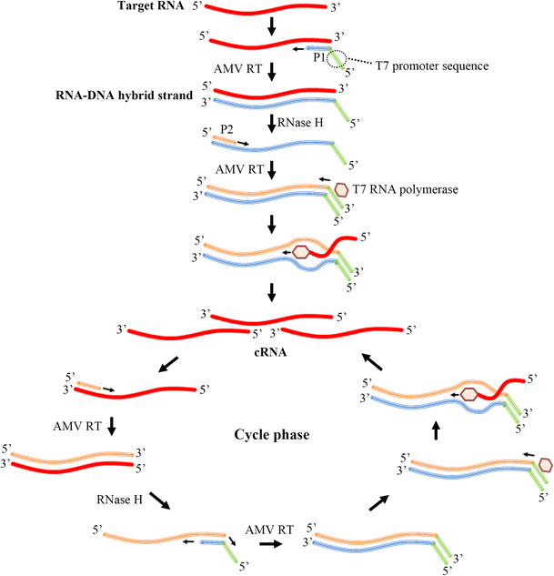

---
output:
  bookdown::pdf_document2:
    fig_caption: yes
    toc: TRUE
    toc_depth: 3
    fontsize: 12pt
    latex_engine: xelatex
bibliography: "Bachelor_quellen.bib"
biblio-style: apalike
citation_package: biblatex
link-citations: yes
urlcolor: RoyalBlue
linkcolor: RoyalBlue
header-includes:
  \usepackage{float}
  \usepackage[ngerman]{babel}
  \usepackage[onehalfspacing]{setspace}
  \usepackage[utf8]{inputenc}
  
---

```{r setup1, include=FALSE}
knitr::opts_chunk$set(echo = FALSE)

library(kableExtra)
library(ggplot2)
library(ggpubr)
library(tidyverse)
library(scales)
library(latex2exp)
```

\pagebreak
# Einleitung

## Viren - Die Gefahr aus dem nichts

Infektionskrankheiten verursacht durch Viren oder multiresistente Bakterien sind eine ernstzunehmende Bedrohung für Menschen und Staaten. Dabei sorgen virale Epidemien und Pandemien wie die Spanische Grippe (1918) mit über 50 Millionen Toten [@Dharmapalan2020], das Chikungunya virus (2006) mit mehr als 1,3 Millionen Infizierten [@Charrel2007], und die aktuelle SARS-CoV-2 Pandemie mit weit über 140 Millionen Infizierten [@Bai2021] für weltweite Kriesen und Milliardenschäden [@Louie2009].  
Viren lassen sich als ca. 16 nm bis 200 nm große infektiöse Einheiten, bestehtend aus einer Proteinhülle mit einem \textcolor{red}{DNA oder RNA} Kern beschreiben. Sie haben keinen eigenen Reproduktionsmechanismus und sind auf die Infizierung von anderen Zellen angewiesen, welche mithilfe ihrer Reproduktions-Maschienerie die Viralen Komponenten vervielfältigen [@Modrow2010]. Viren zeigen eine hohe Mutationsrate wodurch neue Varianten enstehen und diese, durch leicht veränderte Infektionstrukturen Immunlücken besetzen [@Sanjuan2016]. Dadurch entstehen neue Infektionsherde und Pandemien @quelle  
Gerade die vorherrschende SARS-Cov-2 Pandemie hat gezeigt, dass eine frühzeitige, schnelle und effiziente Detektion von viralen Krankheiten notwendig ist, um die Gesundheitssysteme zu entlasten und die Infektionsketten zu unterbrechen [@Valera2021]. Dabei ist die Polymerase Ketten Reaktion (engl.: _Polymerase chain reaction_, PCR) vorherrschende Testmethode, da sie durch die Amplifiaktion von Nucleinsäuren hohe Spezifitäten und sensitivitäten erreicht. Jedoch benötigt die PCR meist mehr als 24h bis zum Ergebnis, sowie spezialisierte Laboratorien und geschultes Personal [@Brendish2015]. Dadurch kann es schwierig werden, die Infektionsketten erfolgreich zu unterbrechen, da erkrankte Patienten binnen der 24h weitere Personen infizieren können [@Sharma2021]. Aus diesem Grund ist es wichtig, die Diagnostik mit sensitiven und kostengünstigen Alternativen zu ergänzen, welche vor Ort durchgeführt werden können; das sogenannte _Point of care testing_ (POCT) [@Goble2016]. Ein großes Feld innerhalb der PoCT spielen dabei isotherme Amplifikationstechniken, welche ebenfalls Erreger anhand ihrer Nukleinsäuren detektieren, jedoch keine großen Geräte erfordern und kürzere Testzeiten bieten. Dadurch können diese Techniken innerhalb des PoCT dezentral für die Diagnostik verwendet werden, was zu einer schelleren Detektion und somit zu einem unterbrechen der Infektionsketten führen kann [@Pumford2020;@Islam2022]. 

## Die Influenza Viren - Pandemieverursacher Nr. 1

erwähnen, dass influenza Grippe ist

### Influenza A

Das zur Virusfamilie der Orthomyxoviren gehörige Influenza A Virus ist ein behülltes, einzelsträngiges RNA Virus. Die genomische RNA, welche in negativer Strang-Orientierung, also entgegen der 5´-3´ Leserichtung der Ribosomen vorliegt, ist in 8 unterschiedlich große Abschnitte unterteilt (siehe Abbildung \@ref(fig:infAstruk)). Das ca. 13.500 bp große, segmentierte Genom codiert dabei für mindestens 17 Proteine, wobei die 3´ und 5´ Regionen keine codogenen Bereiche enthalten, sondern komplementär zueinander sind. Dadurch bilden sie über eine kurze Distanz einen Doppelstrang aus, welcher als Signalsequenz bei Transkription dient [@Modrow2010; @Chen2018]. Von den 17 codierten Proteinen zählen 10 als Essentiell Wichtig, während der Rest als Accessoire-Proteine zählt [@Vasin2014]. Zu den essentiellen  Proteinen zählen die Neuraminidase (NA), welche im Verlauf der Infektion für die Freisetzung der Viruspartikel verantwortlich ist, das Hämagglutinin (HA), welches bei der Infektion der Zelle eine Rolle spielt, das Matrixproteinen (M1), das Membranprotein (M2), die Nichtstrukturproteine NS1 und NS2, das nukleoprotein (NP), sowie die 3 Untereinheiten PA, Pb1 und Pb2 der RNA-Polymerase [@Luo2011; @Krammer2018]. Die Accessoire-Proteinen sind auf alternativen offene Leserahmen (engl.: _open reading frame_, ORF) codiert. Diese erlauben es Viren eine größere Protein-Vielfalt auf engen genomischen Raum, durch die "mehrfachverwendung" einer Nukleotid-Sequenz, zu expremieren. Diese alternativen ORF enstehen dabei durch verschiedene molekularbiologische Mechnanismen, wie _frame shifting_ bei welchem das Ribosom bei der translation eine Base überspringt und somit den Leseramen ändert, _readthrough_ bei dem das Ribosom ein Stopp-codon überspring, oder _internal Ribosom Entry_ wobei das Ribosom an ein interes Start-Codon druch eine sogenannte IRES (engl.: _internal ribosomal entry site_) rekrutiert wird, sowie einige weitere [@Firth2012]. Zu den Accessoire-Proteinen zählen unter anderem das 2012 entdeckte nichtstruktur Protein 3 [@Selman2012], das von M2 abstammende M42 [@Wise2012] und die dem PA zugehörigen Proteine PA-X, PA-N155 und PA-N182 [@Jagger2012; @Muramoto2013].

(ref:label) **Schematischer Aufbau eines Influenza A Virus**: Schematische Darstellung eines Influenza A Virus mit den Längen der einlenen Genom-Segmente in Basenpaaren (bp). Modifizierte nach @Modrow2010. 

```{r infAstruk, fig.align='center', fig.cap= "(ref:label)", out.width= "49%", fig.scap= "Schematischer Aufbau eines Influenza A Virus"}

knitr::include_graphics("Bilder/infA_Virus.png")

```


Die RNA-abhäninge RNA Polymerase des Influenza A Virus besteht wie in Abbildung \@ref(fig:infAstruk) gezeigt aus den 3 Unterheinheiten PA, PB1 und PB2, wobei die Gensequenz für PA auf dem Segment 3, für PB1 auf dem Segment 2 und PB2 auf dem Segment 1 codiert sind [@Krammer2018]. Das heterotrimer assoziert innerhalb des Virus mit den komplementären Sequenzen an den jeweiligen Enden der einzelnen Genom-Segmente. Der restliche Teil der einzelträngigen RNA wird von oligomeren NP gebunden, welches auf dem Segment 5 codiert ist. Dieser RNA-Protein-Komplex ist in der Literatur als vRNP-Komplex (engl.: _viral ribonucleoprotein_) beschrieben [@Krammer2018; @Velthuis2016]. Kryoelektronenmikroskopische Untersuchungen des vRNP-Komplex zeigten eine doppel-helikae Struktur mit einer SChleife am nicht RNA-Polymerase assoziiertenEnde. Die Helix-Struktur wird dabei durch eine Assozitation von unterschiedlich polaren oligo-NP-Proteinen stabilisiert [@Arranz2012].
Das Virion des Influenza A Virus besteht wie in Abbildung aus einer äußeren choletesterol haltigen doppel-Lipid Schicht, in welche die glycoproteine NA, HA und M2 integriert sind [@To2019; @Modrow2010]. \textcolor{red}{Hier schon erwähnen, dass die Membran vom wirt und nicht vom Virus stammt? Oder das doch lieber beim Infektionsmechanismus} Die darunter liegende Proteinmatrix besteht aus oligomeren M1-Proteinen, welche auf dem Genom-Segment 7 codiert sind. Dieses Matrixprotein dient als Angelpunkt und bindet alle anderen Struktur-bildenden Komponenten wie den vRNP-Komplex, die Membranbindenden Glycoproteine, sowie die Lipidmembran durch seine positive Polarität [@Kordyukova2018; @Chlanda2016]. Das M1-Protein erfüllt dadurch eine essentielle Rolle bei dem Zusammenbau des Virus und der nachfolgenden Umhüllung mit Wirts-Lipiden, dem sogenaannten _Budding_ [@Nayak2009].  Durch seine komplexe Funktion und die verschieden Bindungsdomänen für die anderen Strukturkomponenten, ist die Aminosäuresequenz des M1-Protein am stärksten im viralen Genom konserviert [@McCauley1983; @Kordyukova2018].

### Influenza B

## Nachweismethoden von Influenz

## Amplifikation

### RT Polymerase chain reaktion {#RTPCR}

Die PCR, entwickelt von @Mullis1986 ist eine Methode zur Amplifikation von DNA und ist ein Meilenstein in der Molekularbiologie. Erstmals konnten Nukleinsäuren vermehrt werden und somit für Genetik, Forensik und Diagnostik verwendet werden [@Ganova2021]. Das Prinzip der PCR beruht dabei auf 2 ca. 20 bp großen oligonukleiotiden, die sogenannten Primer, welche spezifisch an ein DNA-Fragment binden und von einer hitzestabilen Polymerase verlängert werden. Ein Primerpaar, bestehend aus forward und reverse Primer flankiert jeweils einen definierten DNA-Abschnitt, welcher in einer PCR amplifiziert wird [@Ableitner2018]. Der Reaktionsmechanismus der PCR besteht aus 3 Zyklen; Dentaurierung, Hybridisation und Amplifiaktion.  Im ersten Schritt der Reaktion werden durch hohe Temperaturen (~95°C) die Wasserstoffbrückenbindungen der DNA aufgebrochen und die DNA so denaturiert. Bei dem Hybridisationsschritt wird die Temperatur auf 55 - 65 °C erniedrig und  es können sich die Primer an die DNA anlagern [@Sreejith2018]. Dabei ist der Vorwärtsprimer komplementär zu einer Sequenz auf dem Sense-Strang der DNA und der Rückwärtsprimer komplementär zu einer Sequenz auf dem Antisense-Strang [@Muelhardt2009]. Nun kann im Amplifikationsschritt die Polymerase bei ~72°C die gebundenen Primer Anhand der DNA-Vorlage erweitern und somit die DNA verdoppeln. Für eine erfolgreiche Amplifikation werden mehrere Zyklen hintereinander durchgeführt, wodurch die DNA jedesmal verdoppelt wird [@Sreejith2018]. Die amplifizierte DNA am Ende der PCR kann über eine Gel-Elektrophorese nachgewiesen werden [@Wood1994]. 
Bei RNA als Ausgangsmetrial wird eine reverse Transkriptase-Reaktion vor der PCR durchgeführt, um die RNA und DNA umzuschreiben. Die DNA kann anschließend über den beschriebenen PCR-Mechanismus amplifiziert werden [@Muelhardt2009]. Diese erweiterte PCR wird als reverste Transkriptase PCR (RT-PCR) in der Literatur bezeichnet [@Bustin2005].

Eine besondere Form der PCR ist die quantitative PCR (qPCR). Hierbei wird ein fluoreszierendes Reportermolekül dem Reaktionsmix zugesetzt [@Ma2021]. Über die Messung der Fluoreszenz kann der DNA-Gehalt während der laufenden Reaktion bestimmt werden. Typische Reportermoleküle sind dabei Fluoreszenzmarkierte Oligonukleotide, sogenannten Sonden, welche innerhalb des zu amplifizierenden Bereichs binden [@Ranasinghe2005].
Das Prinzip der Fluoreszenzsonden beruht dabei auf der Interaktion eines fluorophors und einem sogenannten Quencher, welche sich innerhalb der Sonde in räumlicher Nähe befinden. Der Quencher ist ein weiteres Fluorophor, welches von der Emission des Reportermoleküls über einen Förster-Resonanzenergietransfer (FRET) angeregt wird und dadurch verhindert, dass die Fluoreszenz des Reportermoleküls detektiert werden kann [@Ranasinghe2005]. Durch die Exonucleaseaktivität der Polymerase wird die Sonde bei einer erfolgreichen bindung Hydrolisiert und somit Fluorophor und Quencher von einander getrennt [@Thornton2011]. Der Quencher kann nicht mehr das Signal des Reportermoleküls blockieren und die Fluoreszenz kann detektiert werden. Durch das steigende Fluoreszenzsignal kann ein Rückschluss auf die amplifizierte DNA-Menge erfolgen und Reation live verfolgt werden [@Bustin2000; @andereQuelle].


### Isotherme Amplifikation

Wie bereits erwähnt unterliegt die PCR einigen Limitationen, welche sie für die POCT ungeeignet machen. Isotherme Amplifikationstechniken bieten eine dabei eine große Alternative bei der Amplifikation von Nukleinsäuren und für die POCT [@Kang2022]. Ihr großer Vorteil liegt in der simplen Handhabung und der gleichbleibenden Temperatur. Dadurch ist es möglich Nukleinsäuren mit einfachen Gerätschaften wie beispielsweise einem Wasserbad zur vervielfältigen. Seit den 1990 Jahren wurden viele isotherme Methoden entwickelt, welche unterschiedliche Eigenschaften kombinieren und somit Repertoire für verschiedenste Applikationen bildet [@Zhao2015]. In dem folgenden Kapiteln werden ausgewählte Methoden vorgestellt.

### Schleifenvermittelte isotherme Amplifikation 
Die erstmal im Jahr 2000 von @Notomi2000 entwickelte Schleifenvermittelte isotherme Amplifikation (engl.: _loop mediated isothermal amplifikation_, LAMP) ist eine effektive isotherme Amplifikationsmethode von DNA bei einer Konstanten Temperatur von 60 - 65 °C. Im Gegensatz zur der PCR werden bei der LAMP 4 bis 6 Primer verwendet, um die Nukleinsäure zu amplifizieren. Dadurch erreicht die LAMP einerseits sehr hohe Spezifitäten, da die 4 essenziellen Primer binden müssen, andererseits aber hohe Anforderung an die Optimierung und das Primer-Design [@Soroka2021]. Die Primer werden dabei in innere Primer, äußere Primer und sogenannte Loop Primer unterteilt. [@Nagamine2002]. Die äußeren Primer, bestehend aus forward und reverse Primer sind zweigeteilt, wobei der 3´-Teil jedes Primers komplementär zum jeweiligen Strang (forward- / reverse-Strang) ist. Der zweite Teil der Primer hingegen ist komplementär zu einer Stelle auf dem gegenüberliegenden DNA-Strang. Diese Zweiteilung der Primer sorgt im späteren Verlauf der Reaktion für die Bildung einer Hantel ähnlichen Struktur. Die äußeren Primer, ebenfalls bestehend aus forward und reverse Primer binden weiter außen auf dem DNA-Doppelstrang und liegen in niedrigerer Konzentration vor als die inneren Primer. Zusätzlich können optional die Loop Primer verwendet werden, welche in den Köpfen der gebildeten Hantelstruktur binden [@Huang2020]. Ebenfalls nötig für die Amplifikation ist eine DNA-Polymerase, welche eine hohe DNA-Strang Verdrängungs-Aktivität besitzt [@Park2022].  
Der Reaktionsmechanismus der LAMP kann in zwei Phasen unterteilt werden; der nicht zyklischen Phase und der zyklischen Phase. Im ersten Schritt der nicht zyklische Phase hybridisiert einer der inneren Primer mit seinem 3´-Ende an die zu amplifizierende DNA. Dadurch kann eine Strangverlängerung des Primers durch die Polymerase stattfinden und mithilfe der Strang Verdrängungs-Aktivität wird der ursprüngliche Doppelstrang abgelöst. Anschließend bindet der äußere Primer hinter dem neu entstandenen Doppelstrang, es findet abermals eine Strangverlängerung statt und der innere Primer mit der neu synthetisierten DNA wird verdrängt. Der nun entstandene DNA-Einzelstrang besitzt an einem Ende die Sequenz des inneren Primers, und bildet durch den hinteren komplementären Teil des Primers eine Schleife aus.
Der beschriebene Amplifikations-Schritt wird mit den entgegen gesetzten inneren und äußeren Primern wiederholt, sodass eine einzelsträngige DNA entsteht, welche an beiden Enden die Sequenzen der inneren Primer besitzt. Dadurch nimmt diese einzelsträngige DNA, die oben erwähnte Form einer Hantel an und der nicht zyklische Teil der Amplifikation ist damit beendet [@Parida2008].  

(ref:label3) **Primer-Bindungsstellen und Hantelstruktur der LAMP**: **A**: Primerdesign und -bindungsstellen der LAMP. Die inneren Primer besitzen zwei Bindungsstellen auf den unterschiedlichen Strängen der DNA. Die Äußeren Primer liegen "hinter" den inneren und sorgen im Verlauf der Strangverlängerung für eine Verdrängung des DNA-Strangs. **B**: Hantelstruktur als Ausgangspunkt der zyklischen Phase. Die verschiedenen Bindestellen dienen als Startpunkte einer Amplifikation, wodurch eine exponentielle Amplifikation erreicht wird. Modifiziert nach @Soroka2021 

```{r LAMP, fig.align='center', fig.cap= "(ref:label3)", out.width= "70%", fig.scap= "Primer-Bindungsstellen und Hantelstruktur der LAMP"}

knitr::include_graphics("Bilder/LAMP_struktur.PNG")

```

Die gebildete Hantelstruktur dient in der zweiten Phase der Amplifikation als Startpunkt. Hier können nun die verschiedenen Primer gleichzeitig binden und somit die Ziel-DNA exponentiell vervielfältigen. Ebenfalls dient das 3'-Ende der Hantelstruktur als Primer und somit als Startpunkt für die Polymerase. Im Verlauf der Reaktion entstehen verschiedenste Strukturen wie Konkatemere und blumenkohlähnliche Strukturen mit vielen Schleifen [@Soroka2021; @Silva2019]. Ebenfalls kann durch das zusätzliche Einbringen der Loop Primer, die Anzahl der Startpunkte abermals erhöht werden, was zu einer erhöhten Reaktionsgeschwindigkeit führt [@Nagamine2002]. 
Eine Amplifikation von RNA ist ebenfalls unproblematisch möglich, jedoch muss eine Reverse Transkriptase Reaktion vor der LAMP vorgeschaltet werden [@Chander2014].   
Zur Detektion der Amplifikation können kolorimetrische Fluoreszenzfarbstoffe wie Calcein, welche vor der Messung zugegeben werden [@Tomita2008] oder Fluoreszenzfarbstoffen wie SYBR Green I, welche nach Abschluss der Amplifikation zugegeben werden [@Iwamoto2003] verwendet werden. Durch die eine hohe DNA-Endkonzentration von 10-20 µg am Ende der Reaktion kann eine Auswertung mit dem bloßen Auge erfolgen [@Parida2008]. Ebenfalls kann die Messung der Trübung für den Nachweis einer Positiven Reaktion verwendet werden. Durch die extrem hohe Menge an synthetisierter DNA entstehen große Mengen an Pyrophosphat, welches Magnesium-Ionen bindet und bei hohen Konzentrationen ausfällt. Diese Fällung führt zu einer Trübung der Reaktionsmixtur, welches wiederum quantifiziert werden kann [@Mori2001].


### Nukleinsäure sequenz-basierte Amplifikation
Die Nucleinsäure sequenz-basierte Amplifikation ( engl.: _nucleic acid sequence-based amplification_, NASBA), auch bekannt unter _self-sustained sequence replication_ (3SR) ist eine auf der Transkription basierende, isotherme Amplifikationsmethode zum Nachweis von Nukleinsäuren [@Deiman2002]. Die erstmals von @Guatelli1990 erwähnte Methode beruht dabei auf einem Enzym-mix bestehend aus einer reversen Transkriptase (RT), des avian myeloblastosis virus, der RNAse H und einer T7 DNA abhängigen RNA-Polymerase (DdRp) [@Deiman2002]. Eine Besonderheit der NASBA liegt im ersten Schritt der Methode. Hier bindet ein ca. 45 bp langer Primer 1 an das 3´-Ende einer einzelsträngigen RNA. Dadurch eignet sich die NASBA besonders zum Nachweis von RNA-Molekülen, da diese direkt zum Start der Reaktion benötigt werden. Durch diese Eigenschaft unterscheidet sich die NSABA zu anderen Amplifikationsmethoden, wo ein RT-Schritt vorgeschalten werden muss [@Compton1991; @Bachman2013; @Zhang2021]. Dabei hybridisieren nur 20 bp am 3´-Ende des Primers, da sie komplementär zur Ziel-RNA sind. Das 5-Ende hingegen besitzt eine Promotor-Erkennungssequenz für die DdRp. Nachdem der Primer gebunden hat, wird eine cDNA bei einer Temperatur von 41 °C von der im Reaktionsmix enthaltenen RT synthetisiert. Das entstandene cDNA/RNA-Hybrid wird anschließend von der RNAse H verdaut, sodass der einzelsträngige DNA-Anteil mit der Promotorsequenz im Reaktionsmix enthalten ist. Ein zweiter 20 bp langer Primer2, welcher komplementär zur DNA ist, hybridisiert und die RT vervollständigt den DNA-Doppelstrang. Die nun aktive, doppelsträngige T7-Promotorsequenz, rekrutiert die DdRp, welche um die 100 RNA-Kopien pro DNA-\textcolor{red}{Template} erzeugt. Die neu entstandenen RNA-Moleküle gehen in den ersten Zyklus der NASBA ein, indem der Primer2 hybridisiert, die RT ein cDNA/RNA hybrid erzeugt und der RNA-Anteil durch die RNAse H hydrolysiert wird. An diese cDNA bindet wiederum Primer1 und die RT vervollständigt den DNA-Doppelstrang, sodass der Promotor wieder aktiv wird und neue RNA-Kopien erstellt werden können [@Compton1991].  

(ref:label2) **Schematischer Reaktionsmechanismus der NASBA**: Schematische Darstellung des Reaktionsmechanismus der NASBA mit der Initialen Phase und der zyklischen Phase. Die Anfängliche RNA wird durch die Hybridisation von Primern in ein DNA/RNA hybrid überführt, dieses über einen RNAse verdau und erneute DNA synthese in einen DNA-Doppelstrang umgewandelt. Durch den auf dem doppelstrang aktiven Promotor werden viele RNA-Kopien erzeugt, welche in den Amplifikationszyklus eingehen. 

```{r NASBA, fig.align='center', fig.cap= "(ref:label2)", out.width= "49%", fig.scap= "Schematischer Reaktionsmechanismus der NASBA"}



```


Die Amplifikation von DNA-Molekülen als Ausgangsmaterial mittels NASBA ist ebenfalls möglich, jedoch mit einem erhöhten Aufwand und zusätzlichen Denaturierung-Schritten [@Malek1994]. Hierbei hybridisiert nach einem initialen Denaturierungsschritt bei 95 °C Primer1 mit der Ziel-DNA und wird durch die frisch dazugegebene RT verlängert. Da kein cDNA/RNA hybrid entstanden ist, kann die RNAse nicht den Gegenstrang hydrolysieren und ein weiterer Denaturierungsschritt ist nötig. Durch die hohen Temperaturen wird jedoch die RT inaktiviert, wodurch sie mit den anderen Enzymen neu zugegeben werden muss. Anschließend bindet Primer2, der Doppelstrang wird vervollständigt und die DdRp kann über den aktiven Promotor RNA-Kopien erstellen [@Deiman2002].  
Zur Detektion und Quantifizierung der amplifizierten RNA können spezielle hybridisations-Sonden sogenannte "Molecular-Beacon" verwendet werden [@Deiman2002]. Diese Besitzen die Struktur einer Stem-Loop, wobei das eine Ende mit einem Reporterfluorophor und das andere Ende mit einem Quencher gekoppelt sind. Die Stem-Loop ist dabei so ausgebildet, dass die beiden Enden der Sonde komplementär zueinander Sind und somit Reporterfluorophor und Quencher in direkter Nähe zueinander sind. Die Sequenz innerhalb der ausgebildeten Schleife ist komplementär zu einer Region auf dem zu detektierenden RNA-Molekül. Bei der Bindung der Sonde an die Zielregion öffnet sich die SChleife, Reporterfluorophor und Quencher werden voneinander getrennt und ein Fluoreszenzsignal kann detektiert werden [@Omran2022].

### Rekombinase Polymerase Amplifikation

Die von [@Piepenburg2006] entwickelte Rekombinase Polymerase Amplifikation (RPA) ist ein von dem Replikationszyklus der T4 Bakteriophage angepasstes isothermales Amplifikationssystem [@Li2019]. Der Mechanismus beruht dabei auf einem Zusammenspiel aus mehreren Enzymen (recombinase , recombinase loading factor, single-stranded binding protein und DNA-Polymerase), welche die vervielfältigung von DNA koordinieren [@@Li2019; @anquelle]. Im ersten Schritt bindet die T4 UvsX Rekombinase mithilfe des T4 UvsX Rekombinase Co-Enzyms unter ATP verbrauch an einzelsträngige Primer [@Daher2016; @Lobato2018]. Der entstandene Recombinase-Primer-Komplex migriert entlang doppelsträngiger DNA und sucht zu den gebundenen Primern homologe Sequenzen.  

8tel ansatz erwähnen


## Ziel der Arbeit

Das Projekt R&C.net befasst sich mit der Erstellung eines mobilen Kofferlabors für die Point of Care Diagnostik und vor Ort Analytik. Schwerpunkt bildet dabei die Detektion viraler Atemwegs-Infektionserkrankungen. Ziel der Arbeit ist es, jeweils ein RPA-System für den Einsatz im Kofferlabor zum Nachweis der Influenza A und B Viren zu entwickeln. Dabei soll das Influenza A System die relevanten Subtypen H3N2 und H1N1 nachweisen können und die Influenza B RPA alle PAN-Influenza B Viren detekieren können. Die Entwicklung der RPA-Systeme unterteilt sich dabei in das Design von Primer-Sonden-Sets, welche anschließend auf Eignung geprüft werden, sowie Sensitivitäts- und Spezifitätstest des geeigneten Systems. Des Weiteren soll die Wirksamkeit der Entwickelten RPA-Systeme in einem klinischen Probenhintergrund getestet und die Sensitivität mit PCR-Systemen für die Detektion der gleichen Viren verglichen werden. Um diese Tests durchführen zu können ist die _in vitro_ Erstellung einer artifizieller Viraler RNA notwenig. Des Weiteren ist es ein Ziel Optimierungschritte zur Verbesserung der RPA-Performance vorzunehmen. Dabei sollen Reaktionstemperatur, Mischzeitpunkt der Reaktion sowie Ansatzvolumen im Verlgeich zwischen 50 µl und 6 µl (8tel Ansatz) untersucht werden. Zusätzlich soll überprüft werden, ob eine Primerassymetrie einen positiven Einfluss auf die Reaktion ausübt.


\pagebreak


