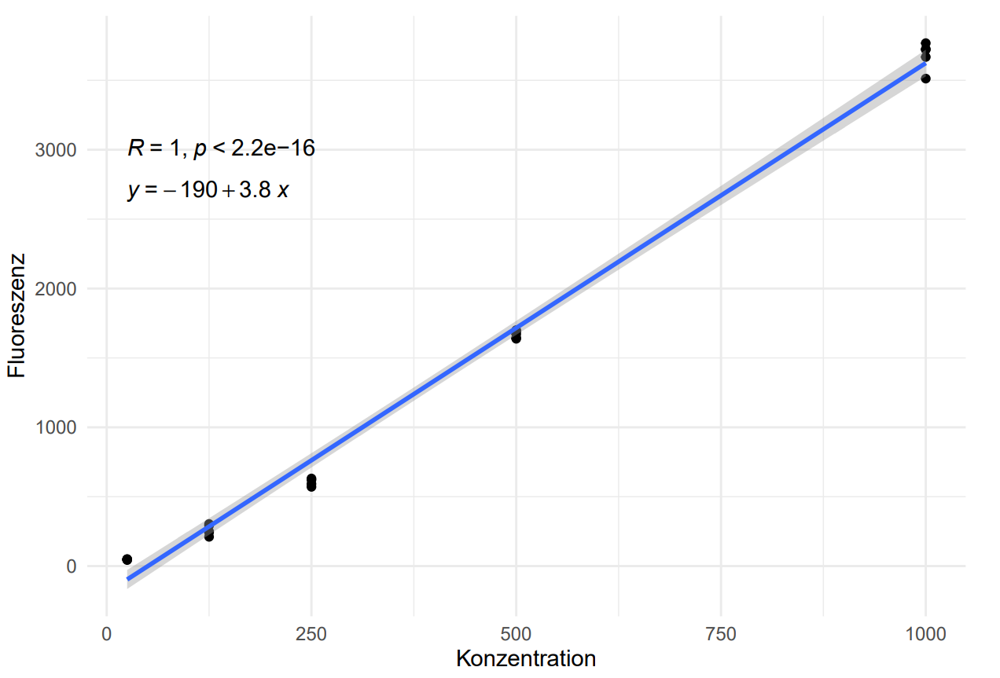
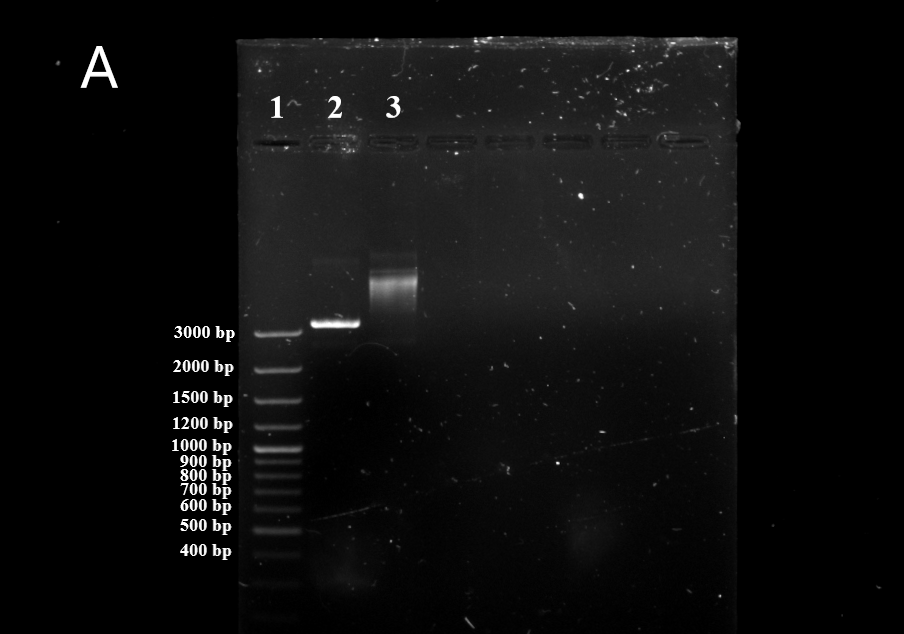
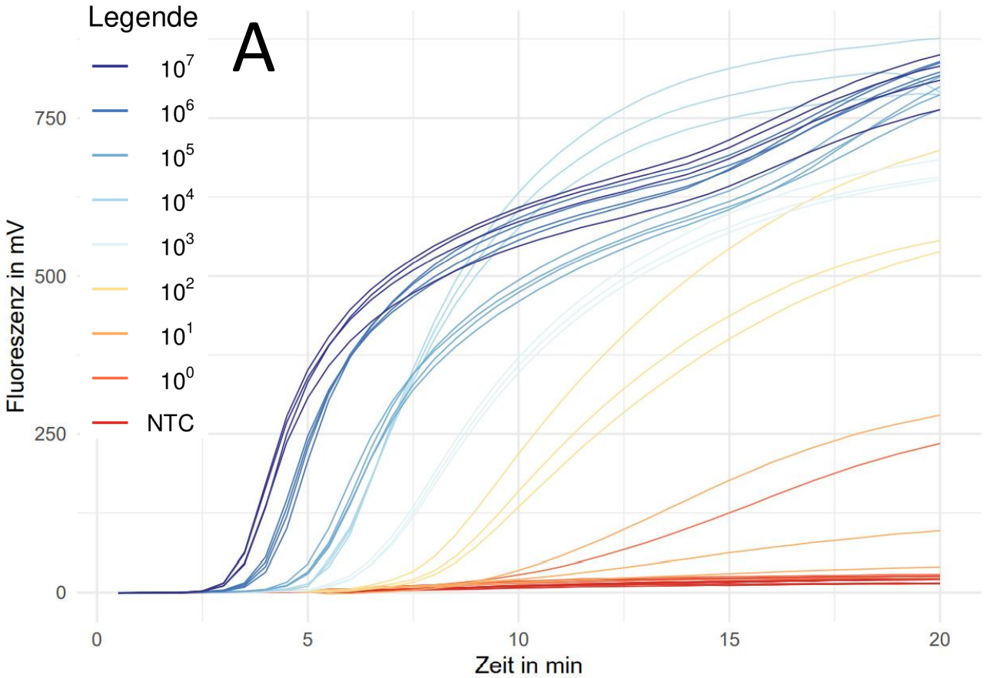
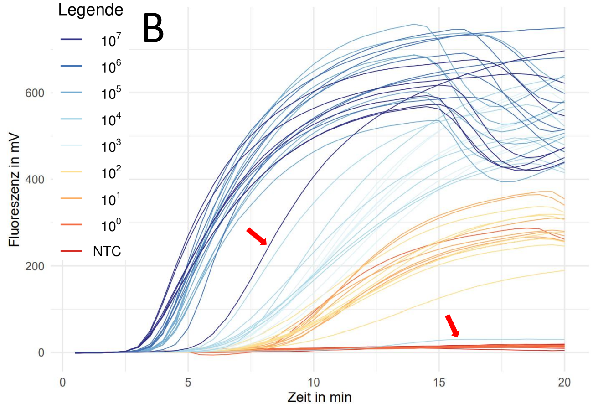
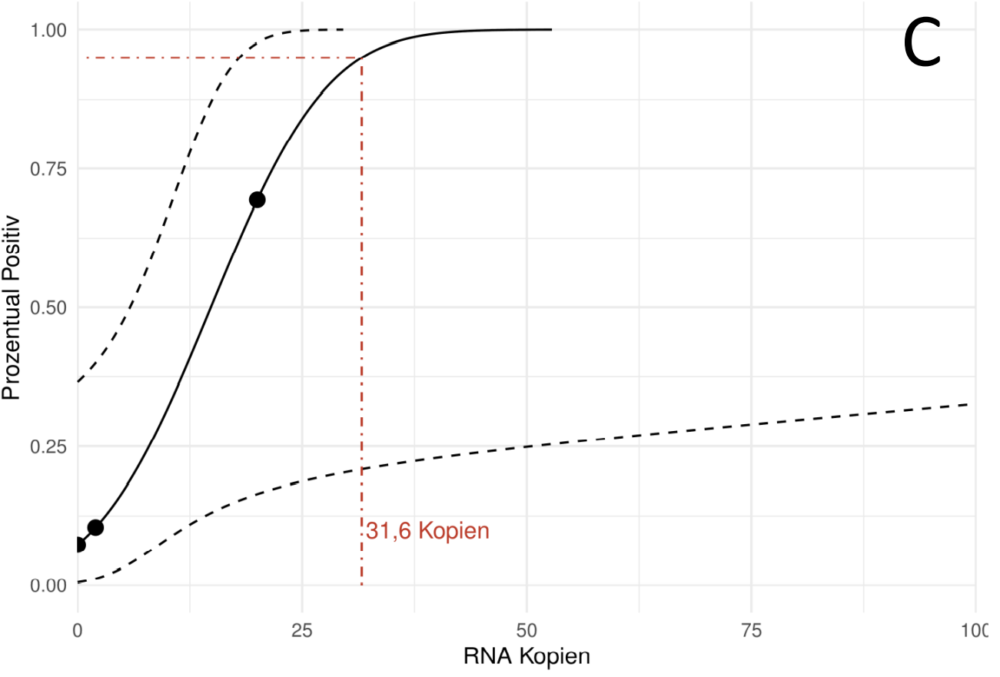
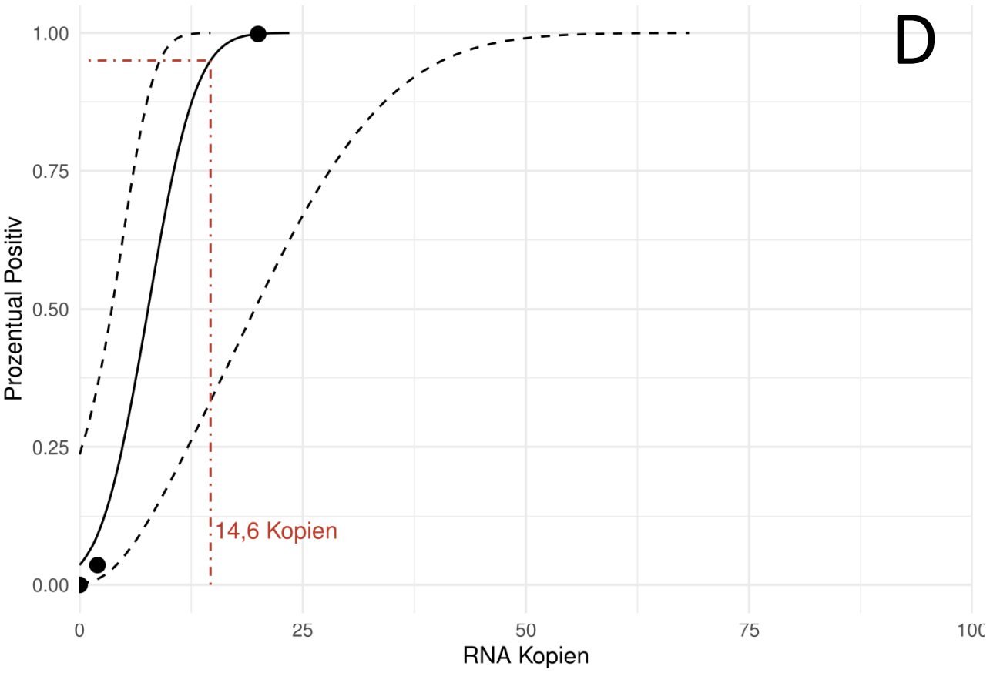

---
output:
  bookdown::pdf_document2:
    fig_caption: yes
    toc: TRUE
    toc_depth: 3
    fontsize: 12pt
    latex_engine: xelatex
bibliography: "Bachelor_quellen.bib"
biblio-style: apalike
citation_package: biblatex
link-citations: yes
urlcolor: RoyalBlue
linkcolor: RoyalBlue
header-includes:
  \usepackage{float}
  \usepackage[ngerman]{babel}
  \usepackage[onehalfspacing]{setspace}
  \usepackage[utf8]{inputenc}
  
---

```{r setup3, include=FALSE}
knitr::opts_chunk$set(echo = FALSE)

library(kableExtra)
library(ggplot2)
library(ggpubr)
library(tidyverse)
library(scales)
library(latex2exp)


```

# Ergebnisse

## Entwicklung eines Rekombinase Polymerase Amplifikationssystems für das Influenza A Virus

### Herstellung der Influenza A Virus Standard-RNA 

Für die Durchführung und den Vergleich von verschiedenen Nukleinsäure-Amplifikationsverfahren, ist es nötig, standardisierte Virus-RNA mit einer definierten Konzentration herzustellen. Dabei dient ein DNA-Plasmid mit der entsprechenden Virus-Sequenz als Ausgangsmaterial. Dieses wurde in _E. coli_ transformiert, durch Kultivierung vermehrt und anschließend mittels verschiedener Methoden zur gewünschten Virus-RNA transkribiert. 

Um die Gruppe der Influenza A Viren ausreichend abdecken zu können wurden RNA-Standards von den akutell vorherrschenden Subtypen H1N1 und H3N2 erstellt. Damit die Detektion von älteren Varianten der beiden Subtypen untersucht werden kann, wurden zusätzlich RNA-Standards von früher dominanten Subtypen hergestellt. Für den H1N1-Subtyp wurde dabei eine DNA-Sequenz aus dem Jahr 2004 und für den H3N2-Subtyp eine Sequenz aus dem Jahr 2005 als Vorlage verwendet. Alle nachfolgenden Schritte dieses Kapitels wurden für alle vier RNA-Standards gleich durchgeführt.   
Für die Erstellung der Standard-RNA's wurden im ersten Schritt die entsprechenden Virus DNA-Sequenzen als teil eines DNA-Plasmids nach beschriebener Methode (siehe Kapitel \@ref(transformation)) in _E. coli_ transformiert. Anschließend wurden die transformierten Bakterien, wie in Kapitel \@ref(isolation) angegeben kultiviert und die Plasmid-DNA isoliert. Durch eine anschließende Sequenezierung konnten Sequenzfehler durch Mutationen ausgeschlossen werden. Im nächsten Schritt wurden die isolierten Plasmide durch einen Restriktionsverdau linearisiert und somit für die _in vitro_ transkription vorbereitet. Der Restriktionsverdau wurde wie in Kapitel \@ref(verdau) angegeben durchgeführt. Die zur Überprüfung der erfolgreichen linearisierung durchgeführten Agarose-Gele sind in Abbildung \@ref(fig:infAverdau) gezeigt. Alle verdauten Plasmide zeigen eine DNA-Bande bei ~ 3300 bp. Die ungeschnittenen mitgeführten Kontrollplasmide aus der vorherigen Plasmid-DNA isolation weisen hingegen eine Bande zwischen 5000 bp und 6000 bp auf. Eine Ausnahme bildet hierbei das Kontrollplasmid auf der Gelspur 5, da keine DNA-Bande sichtbar ist. 
 

(ref:infaverA) **Kontrollgel des Restriktionsverdaus und Ribogreen Kalibrationsgeraden der Influenza A Plasmide**: **A**: DNA-Banden des Kontrollgels für den Restriktionsverdau der Influenza A Plasmide. DNA-Banden des verdautem Plasmid des 2005 H3N2 Standards (2) mit unverdauter Kontrolle (3), verdautem Plasmid des aktuellem H1N1 Standards (4) mit unverdauter Kontrolle (5) sowie verdautem Plasmid des aktuellen H3N2 Standard (6) mit unverdautem Kontrollplasmid (7), sowie mitgeführte 100 bp plus DNA-Leiter (8) und 1000 bp DNA-Leiter (1).  DNA-Banden des verdautem Plasmid des 2004 H1N1 Standards (2) mit unverdautem Kontrollplasmid (3) und mitgeführter 100 bp plus DNA-Leiter (1). Bilder digital bearbeitet. **B, C** Kalibrationsgeraden des Ribogreen-Assays mit angefügter Geradengleichung, Korrelationskoeffizienten und p-Wert. Das graue Band zeigt das 95 %-ige Konfidenzintervall der linearen Funktion. Alle Messungen wurden mit n=5 durchgeführt.

```{r infAverdau, message = FALSE, fig.show='hold', fig.cap="(ref:infaverA)", out.width= "49%", fig.align='center', fig.scap="Kontrollgel des Restriktionsverdaus und Ribogreen Kalibrationsgeraden der Influenza A Plasmide."}

knitr::include_graphics("Bilder/infA_verdau.png")



  
```

Zur Weiteren Vorbereitung der linearisierten Plasmid-DNA für die _in vitro_ Transkription und als Nachbehandlung von den Restriktionsverdau wurden die verdauten Plasmide nach der in Kapitel \@ref(cleaning) beschriebenen Methode von Enzym- und Pufferrückständen entfernt. Die gereinigte DNA wurde im nächsten Schritt mithilfe der in Kapitel \@ref(transkription) angegeben Methode zu RNA reverse Transkribiert und die Ausgangs-DNA beseitigt. In der nachfolgenden Aufreinigung wurde die Nukleinsäure abermals von störenden Puffer und Enzymrückständen befreit. Die reine, artifiziell erstellte virale RNA wurde im letzten Schritt nach mithilfe des Ribogreen-Assays quanitifiziert (siehe Methode unter Kapitel \@ref(ribogreen)). \textcolor{red}{Dabei wurden jeweils die RNA-Standards H3N2 (2005) und H1N1 (2020) innerhalb einer Messung und die Standards H1N1 (2004) und H3N2 (2020) in einem seperaten Assay quantifiziert. Die Kalibriergeraden der Assays sind in Abbildung \@ref(fig:infAverdau) gezeigt. Beide Kalibriergeraden besitzen einen Korrelationskoeffizienten (R) von 1 und einen p-Wert von >> 0,05. Daraus lässt sich ein starker linearer Zusammenhang zwischen Konzentration und Fluoreszenz erkennen. Mithilfe der angegeben Geradengleichungen von $y=-190 + 3,8 x$ und $y=-190 + 3,8 x$ für die jeweiligen Messungen konnten die Konzentrationen der gemessenen viralen RNA-Standards berechnet werden.} Die Mittelwerte von jeweils 5 Messungen pro Standard sind zusammen mit den daraus resultierenden Kopie-Zahlen der einzelnen RNA-Moleküle/µl in Tabelle \@ref(tab:infAtranskription) angegeben. 

```{r infAtranskription}
infAtranskription <- read.csv2("infA_copy_numbr.csv", header = FALSE, fileEncoding="latin1")

kable(infAtranskription, booktabs = TRUE, format = "latex", escape = FALSE,  col.names = NULL, caption = "Quantifizierung der Influenza A RNA-Standards") %>%
  add_header_above(c("RNA-Standard"= 1, "Mittelwert der Konzentration"= 1, "RNA-Kopien pro µl"=1), line_sep=0) %>%
  kable_styling(latex_options = "hold_position")

```


### Entwicklung von spezifischen Primern und Sonden für das Influenza A Virus

Mithilfe der in Kapitel \@ref(desing) beschriebenen Methode konnten für das Influenza A Virus insgesamt 8 verschiedene Primer-Sonden-Kombinationen im Bereich zwischen 20 bp und 248 bp entwickelt werden. Durch die Einführung von degenerierten Basen in die Oligonukleotide wurden übermäßige Basenfehlpaarungen bei dem Alingment an die unterschiedlichen DNA-Sequenzen der beiden Subtypen H1N1 und H3N2 vermieden. Dabei wurden nicht mehr 3 Fehlpaarungen pro Oligonukleotid erreicht. Zusätzlich konnten vermieden werden, dass diese an dem für die Amplifikation benötigten 3´-Ende sitzen. 
Alle Kombinationen wurden mit 10^7^ Kopien des viralen RNA-Standards des aktuellen H3N2 Subtypes in einer Dreifachbestimmung (n=3) auf Amplifikation getestet. Dabei konnte keine Variante eine zufriedenstellende Amplifikation vorweisen, wie in Abbildung \@ref(fig) im Anhang zu sehen. 


### Influenza A PCR


```{r InfAPCR, fig.align='center',message = FALSE, out.width= "49%", fig.show='hold', fig.cap= "A und C H3N2..... B und D H1N1"  }

knitr::include_graphics("Bilder/infA_PCR_H3N2.png")
knitr::include_graphics("Bilder/infA_PCR_H1N1.png")

data <- read.csv2("daten/regression3.csv")


ggplot(data, aes(konz, ct)) +
  geom_point() +
  geom_smooth(method = "lm") +
  theme_minimal()+
   ylab("Ct-Wert")+
   xlab("Konzentration") +
  scale_x_log10(breaks = trans_breaks('log10', function(x) 10^x),
                  labels = trans_format('log10', math_format(10^.x)))+
  stat_cor(label.y = 28, 
           aes(label = paste(after_stat(rr.label), after_stat(p.label), sep = "~`,`~"))) +
  stat_regline_equation(label.y = 25)+
  annotate(geom="text", x=500, y=37, label="C", color="black", size=12)


data <- read.csv2("daten/regression2.csv")


ggplot(data, aes(konz, ct)) +
  geom_point() +
  geom_smooth(method = "lm") +
  theme_minimal()+
   ylab("Ct-Wert")+
   xlab("Konzentration") +
  scale_x_log10(breaks = trans_breaks('log10', function(x) 10^x),
                  labels = trans_format('log10', math_format(10^.x)))+
  stat_cor(label.y = 28, 
           aes(label = paste(after_stat(rr.label), after_stat(p.label), sep = "~`,`~"))) +
  stat_regline_equation(label.y = 25)+
  annotate(geom="text", x=500, y=37, label="D", color="black", size=12)

```


### Etablierung InfA


## Entwicklung eines Rekombinase Polymerase Amplifikationssystems für das Influenza B Virus

kleiner Einleitungstext... (kommt darauf an, was ich in der Einleitung/theoretischem Hintergrund dazu schreibe)

### Rekombinase Polymerase Amplifikation-Primerdesing für das Influenza B Virus{#eprimer}

Für das Influenza B Virus konnten nach der beschriebenen Methode (siehe \@ref(desing)) insgesamt 10 verschiedene Primer-Sonden-Kombinationen gefunden werden. Davon befanden sich 2 Kombinationen im Bereich zwischen 625-756 Basenpaare und 8 im Bereich von 443-615 Basenpaare. Diese wurden in einer Dreifachbestimmung (n=3) nach Methode \@ref(RPAnormal) getestet. Dabei zeigte das Primer-Sonden-Paar, welches in Tabelle \@ref(tab:RPAoligo) beschrieben ist, die besten Ergebnisse. Dieses Primer-Sonden-Set wurde für alle weiteren Rekombinase Polymerase Amplifikationen innerhalb dieses Abschnitts verwendet. Der Amplifikationsbereich liegt dabei zwischen 625 und 749 Basenpaaren.

### Herstellung der Influenza B Virus Standard-RNA {#standardherstellung}

\textcolor{red}{Für die Durchführung und den Vergleich von verschiedenen Nukleinsäure-Amplifikationsverfahren, ist es nötig, standardisierte Virus-RNA mit einer definierten Konzentration herzustellen.} Dabei diente ein DNA-Plasmid mit der entsprechenden Virus-Sequenz als Ausgangsmaterial. Dieses wurde in _E. coli_ transformiert, durch Kultivierung vermehrt und anschließend mittels verschiedener Methoden zur gewünschten Virus-RNA transkribiert.

Da für das Influenza B Virus innerhalb der Arbeitsgruppe schon eine transformierte Bakterienkolonie vorhanden war, konnte direkt eine Kultivierung mit anschließender Plasmid-Extraktion nach beschriebener Methode (siehe Kapitel \@ref(isolation)) erfolgen. Durch eine Sequenzierung (siehe \@ref(sequenzierung)) konnten mögliche Sequenzfehler der extrahierten DNA ausgeschlossen werden.

Der anschließende Restriktionsverdau (siehe Kapitel \@ref(verdau)) diente dazu, das Plasmid zu linearisieren und somit für die in vitro Transkription vorzubereiten. Das Kontrollgel ist in Abbildung \@ref(fig:infBverdau) gezeigt. Die darin enthaltenen DNA-Banden zeigen unterschiedliche Größen, wobei das verdaute Plasmid deutlich unter dem unverdauten Kontrollplasmid liegt. Um mit der verdauten DNA weiterzuarbeiten, mussten Puffer und Enzymrückstände vom Restriktionsverdau entfernt werden. Dazu wurde der Restriktionsansatz nach beschriebener Methode (siehe Kapitel \@ref(cleaning)) gereinigt.


```{r infBverdau, fig.align='center',message = FALSE, fig.cap= "\\textbf{Kontrollgel und Ribogreen Kalibrationsgerade der Influenza B Standardherstellung:} \\textbf{A:} DNA-Banden des Kontrollgels für den Restriktionsverdau des Influenza B Plasmids mit verdautem Plasmid (2), unverdautem Kontrollplasmid (3) und mitgeführter DNA-Leiter (1). Das linearisierte Plasmid läuft bei ca. 3300 bp und somit unter dem mitgeführten ungeschnittenem Kontrollplasmid. Das Kontrollplasmid zeigt keine klare Bande. Bild ist digital bearbeitet. \\textbf{B:} Kalibrationsgerade des Ribogreen-Assays mit angefügter Geradengleichung, Korrelationskoeffizienten und p-Wert. Das graue Band zeigt das 95 \\%-ige Konfidenzintervall der linearen Funktion. Alle Messungen wurden mit n=4 durchgeführt. ", out.width= "49%", fig.show='hold', fig.scap="Kontrollgel und Ribogreen Kalibrationsgerade der Influenza B Standardherstellung"}




data <- read.csv2("Daten/V_0027.csv")

ggplot(data, aes(konz, fluo)) +
  geom_point() +
  geom_smooth(method = "lm") +
  theme_minimal()+
   ylab("Fluoreszenz")+
   xlab("Konzentration") +  
  stat_cor(label.y = 2700, 
           aes(label = paste(..rr.label.., ..p.label.., sep = "~`,`~"))) +
  stat_regline_equation(label.y = 2400)+
  annotate(geom="text", x=10, y=3500, label="B", color="black", size=12)


```

Die Herstellung der Virus-RNA wurde, wie in Kapitel \@ref(transkription) mit dem linearisierten Plasmid beschrieben durchgeführt und im Anschluss mit dem Ribogreen-Assay nach beschriebener Methode (siehe Kapitel \@ref(ribogreen)) quantifiziert. Die Kalibrationsgerade des Assays ist in Abbildung \@ref(fig:infBverdau) gezeigt. Die Kalibrierung ergab eine Geradengleichung von $y=22+3,6x$ mit einem Korrelationskoeffizient R = 0.99. Anhand dieser Geradengleichung konnte die hergestellte RNA in einer Fünffachbestimmung (n=5) quantifiziert werden. Der Influenza B Virus RNA-Standard besitzt eine Konzentration von $476.0 \pm 7,8$ ng/ml und somit eine Kopienanzahl von rund $2,2 *10^8$ Kopien/µl.

### Ermittlung der Sensitivität der Influenza B PCR

Zur Überprüfung der Sensitivität und um ein etabliertes Amplifikationssystem zum Vergleich heranziehen zu können, wurde das in Kapitel \@ref(rtpcr) gezeigte Influenza B PCR-System auf die Sensitivität getestet. Dazu wurde der in Kapitel \@ref(standardherstellung) hergestellte Standard auf $2*10^7$ Kopien/µl verdünnt und in \textcolor{red}{dekadischen Verdünnungsstufen} bis zu $2*10^0$ in jeweils einer Mehrfachbestimmung (n=7) auf eine Amplifikation nach beschriebener Methode \@ref(rtpcr) untersucht. Die normalisierten Fluoreszenzwerte der Amplifikationen sowie der lineare Zusammenhang der Ct-Werte (ermittelt nach der in \@ref(chipPCR) beschriebenen Methode) sind in Abbildung \@ref(fig:infBPCR)A und B gezeigt. Für die Ermittlung der Sensitivität wurden die Amplifikationsergebnisse in das in Kapitel \@ref(probit) beschriebene R-Skript eingefügt. Die berechnete Sensitivitätsgrenze bei einer 95 %-igen Wahrscheinlichkeit liegt bei 11,3 Kopien (siehe Abbildung \@ref(fig:infBPCR)C). 

```{r infBPCR, fig.show='hold', message = FALSE, fig.cap="\\textbf{Sensitivitätsanalyse der Influenza B PCR:} \\textbf{A:} Amplifikationsgraphen der Influenza B PCR bei verschiedenen Konzentrationen (n=7). \\textbf{B:} Linearer Zusammenhang der Ct-Werte über die Konzentration mit angefügter Geradengleichung, Korrelationskoeffizienten und p-Wert. Das graue Band zeigt das 95 \\%-ige Konfidenzintervall der linearen Funktion. Ct-Werte negativer Amplifikationen wurden vernachlässigt und sind nicht gezeigt. \\textbf{C:} Probit-Analyse der Amplifikationsdaten. Die schwarz durchgezogene Linie zeigt, die Probit-Regression der PCR. Die schwarzen gestreiften Linien beschreiben das oberer und untere 95 \\%-ige Konfidenzintervall der Probit-Regression. Die rot gestreifte Linie zeigt die ermittelte Sensitivitätsgrenze, bei welcher 95 \\% der Amplifikationen positiv sind.", out.width= "49%", fig.align='center', fig.scap="Sensitivitätsanalyse der Influenza B PCR"}

knitr::include_graphics("Bilder/infB_PCR_sensi.png")
   
data <- read.csv2("Daten/regression.csv")


ggplot(data, aes(konz, ct)) +
  geom_point() +
  geom_smooth(method = "lm") +
  theme_minimal()+
   ylab("Ct-Wert")+
   xlab("Konzentration") +
  scale_x_log10(breaks = trans_breaks('log10', function(x) 10^x),
                  labels = trans_format('log10', math_format(10^.x)))+
  stat_cor(label.y = 28, 
           aes(label = paste(..rr.label.., ..p.label.., sep = "~`,`~"))) +
  stat_regline_equation(label.y = 25)
  annotate(geom="text", x=1000000, y=35, label="B", color="black", size=12)

knitr::include_graphics("Bilder/infB_probit.png")

#Zitation: Sktript entwickelt von Ole Bährmann, beschrieben durch (quelle vom Coronapaper), modifiziert und an meine Daten angespasst durch mich
   
```


### Etablierung der Influenza B Rekombinase Polymerase Apmlifikations-Assays

Um das in Kapitel \@ref(eprimer) getestete Primer-Sonden-Set zu etablieren, wurde eine RPA im Original-Volumen (50 µl) nach der beschriebenen Methode (siehe Kapitel \@ref(RPAnormal)) und eine RPA im 8tel-Ansatz (Methode siehe Kapitel \@ref(8telRPA)) mit jeweils 10^6^ Virus RNA Kopien/µl durchgeführt. Die Amplifikation wurde bei 40 °C durchgeführt. Eine Unterbrechung der Messung durch einen Mischschritt fand nicht statt. Die normalisierten Fluoreszenzdaten sind in Abbildung \@ref(fig:infBetabl) gezeigt. Es ist zu erkennen, dass die 8tel RPA im Vergleich zu der 50 µl RPA im Verlauf der Reaktion an maximaler Intensität verliert. Um die Anstiegszeiten der beiden RPA-Reaktionstypen zu vergleichen, wurden die nach Kapitel \@ref(chipPCR) ermittelten TT-Werte mit der in Kapitel \@ref(tt-wert) beschriebenen Methode untersucht. Es konnte kein signifikanter Unterschied der Anstiegszeit zwischen den beiden Reaktionstypen festgestellt werden (siehe Tabelle \@ref(tab:tabeins) im Anhang). 


(ref:etablB) **Etablierung der Influenza B RPA im Original- und 8tel-Ansatz:** Normalisierte Fluoreszenzdaten der 50µl RPA (n=3) und der 8tel RPA (n=6). Messung bei 40 °C ohne Unterbrechung durch einen Mischschritt. Messung mit jeweils 10^6^ Virus-RNA-Molekülen/µl als Ausgangsmaterial

```{r infBetabl, fig.show='hold', message = FALSE, fig.cap="(ref:etablB)", out.width= "70%", fig.align='center', fig.scap="Etablierung der Influenza B RPA im Original- und 8tel-Ansatz."}

knitr::include_graphics("Bilder/infB_etab.png")
  
```

### Optimierung der Influenza B Rekombinase Polymerase Amplifikation{#optib}

Um die Influenza B RPA zu optimieren, wurden die Reaktionsparameter Mischzeit und Reaktionstemperatur untersucht, um die bestmöglichen  Reaktionsbedingungen zu ermitteln. Des Weiteren wurde in Kapitel \@ref(aksjdalf) gezeigt, dass eine erhöhte Reverseprimer-Konzentration bessere Amplifikation zur Folge hat. Aus diesem Grund wurde die Primer-Konzentration als weiterer Optimierungsparameter untersucht.   
Wie in Abbildung \@ref(fig:infBoptil)A zu sehen, weist die Reaktion bei 38 °C einen späteren Anstieg des Fluoreszenzsignals und somit signifikant höhere TT-Werte (siehe Tabelle \@ref(tab:tabzwei)) auf als bei 40 °C oder 42 °C. Zwischen 40 °C und 42 °C konnten keine signifikanten Unterschiede bei den TT-Werten festgestellt werden.
Des Weiteren weist die RPA bei 38 °C Reaktionstemperatur im späteren Verlauf der Reaktion die niedrigste Fluoreszenzintensität auf. Die Reaktion bei 42 °C zeigt ebenfalls eine niedrigere Fluoreszenzintensität als Messung bei 40 °C. Zusätzlich lässt sich bei 42 °C eine weitere Abnahme des Fluoreszenzsignals nach ~ 13 Minuten beobachten. Das gleiche Phänomen tritt ebenfalls bei 40 °C Reaktionstemperatur auf, jedoch erst später ab ~ 15 Minuten und nur bei 4 von 6 Reaktionen. Alle Reaktionen wurden nach beschriebener Methode (siehe Kapitel \@ref(8telRPA)) ohne eine Unterbrechung der Messung durch einen Mischschritt durchgeführt.     
Bei der Optimierung der Mischzeit (Fluoreszenzdaten in Abbildung \@ref(fig:infBobtiam) im Anhang) konnte beobachtet werden, dass bei Konzentrationen von 10^3^ Virus RNA-Molekülen ein zusätzlicher Mischschritt bei 3 oder 4 Minuten eine geringe, aber signifikante Verringerung des TT-Wertes zur Folge hat (siehe Tab. \@ref(tab:tabvier) im Anhang). Signifikante Veränderungen des TT-Wertes konnten innerhalb der unterschiedlichen Mischzeiten nicht beobachtet werden. Ebenfalls konnten keine Unterschiede in der Fluoreszenzintensität am Ende der Messung sowohl bei den getesteten Mischzeiten als auch bei der Referenzmessung ohne zusätzlichen Mischschritt festgestellt werden. Bei 10^1^ Amplifikaten/µl als Ausgangsmaterial zu Beginn der Messung zeigte ein Mischschritt nach 5 Minuten eine Verbesserung der Amplifikation (siehe Abbildung \@ref(fig:infBobtiam)A und B im Anhang). Bei der Auswertung der Fluoreszenzdaten nach der beschriebenen Methode (siehe Kapitel \@ref(chipPCR)) konnte die Anzahl der positiven Amplifikationen von 3/7 (ohne Mischschritt) auf 7/7 (zusätzlicher Mischschritt nach 5 Min.) erhöht werden.   
Die Fluoreszenzdaten der Optimierung der Primer-Konzentration sind in Abbildung \@ref(fig:infBoptil)B gezeigt. Es ist zu erkennen, dass eine Erhöhung der Reverseprimer-Konzentration auf 1,5X mit einer Erhöhung der Fluoreszenzintensität einhergeht. Bei einer weiteren Erhöhung auf eine doppelte Reverseprimer-Konzentration ist ein Abfall der Fluoreszenz bei ~ 12 Minuten bei 4 von 6 Reaktionen zu beobachten. Es konnte keine signifikante Veränderung des TT-Wertes bei den untersuchten Primer-Konzentration festgestellt werden (siehe Tab. \@ref(tab:tabdrei) im Anhang). Alle Messung wurden nach beschriebener Methode (siehe Kapitel \@ref(8telRPA)) bei 40 °C und ohne zusätzlichen Mischschritt durchgeführt. 

Somit konnten als Parameter für die folgenden Messungen ein Temperaturoptimum von 40 °C, ein zusätzlicher Mischschritt bei 5 Minuten und eine 1,5X erhöhte Reverseprimer-Konzentration als Optimal herausgefunden werden.

(ref:nfBoptil) **Einfluss der Temperatur und der Primerkonzentration auf die Influenza B RPA:** **A**: Normalisierte Fluoreszenzdaten der Influenza B RPA bei 3 verschiedenen Temperaturen in n=6 mit jeweils 10^6^ Amplifikaten/µl als Ausgangsmaterial. Assay im 8tel-Ansatz durchgeführt. Messung ohne zusätzlichen Mischschritt durchgeführt. **B**: Normalisierte Fluoreszenzdaten der Influenza B RPA bei verschiedenen Reverseprimer-Konzentrationen in n=6 mit jeweils 10^6^ Amplifikaten/µl als Ausgangsmaterial. RPA im 8tel-Ansatz durchgeführt.  Messung bei 40 °C und ohne zusätzlichen Mischschritt. Als Referenz (Blau) wurde die RPA mit unveränderter Primer-Konzentration mitgeführt.
 
```{r infBoptil, fig.show='hold', message = FALSE, fig.cap="(ref:nfBoptil)", out.width= "49%", fig.align='center', fig.scap="Einfluss der Temperatur und der Primerkonzentration auf die Influenza B RPA"}

knitr::include_graphics("Bilder/infB_opti_temp.png")

knitr::include_graphics("Bilder/infB_opti_konz.png")

```

### Ermittlung der Sensitivität der Influenza B Rekombinase Polymerase Amplifikation

Um die optimierte Influenza B RPA zu charakterisieren, wurde eine Sensitivitätsmessung durchgeführt, um die minimal detektierbaren viralen RNA-Moleküle zu ermitteln. Dazu wurde der in \@ref(standardherstellung) hergestellte Standard auf $2*10^7$ Kopien/µl verdünnt und in \textcolor{red}{dekadischen Verdünnungsstufen} bis zu $2*10^0$ in jeweils einer Mehrfachbestimmung von n=7 auf eine Amplifikation getestet. Dabei wurde jeweils die Verdünnungsreihe innerhalb der 50 µl RPA (Methode siehe Kapitel \@ref(RPAnormal)) und der 8tel RPA (Methode siehe Kapitel \@ref(8telRPA)) gemessen. Die beiden Systeme wurden dabei mit den in Kapitel \@ref(optib) angegebenen optimalen Reaktionsparametern durchgeführt. Eine Unterbrechung der Messung durch einen Mischschritt nach 5 Minuten erfolgte in der 50 µl RPA bei RNA-Konzentrationen von 10^4^ Molekülen/µl und niedriger. Bei der 8tel RPA wurde die Messung durch den benannten Mischschritt bei 10^2^ Molekülen/µl und niedriger unterbrochen. Die normalisierten Fluoreszenzdaten der Amplifikationen sind in Abbildung \@ref(fig:infBsensi)A und B gezeigt. Die Auswertung der Daten wurde mit der in Kapitel \@ref(chipPCR) beschriebenen Methode durchgeführt. Die ermittelten TT-Werte sowie deren linearer Zusammenhang bei verschiedenen Konzentrationen sind für beide Assays im Anhang unter Abbildung \@ref(fig:..) gezeigt. Für die 50 µl RPA konnte eine Geradengleichung von $y= 11-1,3x$ mit einem Bestimmtheitsmaß von $R^2= 0,93$ ermittelt werden. Die 95 %ige Detektionswahrscheinlichkeit liegt hier, wie in Abbildung \@ref(fig:infBsensi)C gezeigt, bei 31,6 RNA-Molekülen. Für die 8tel RPA konnte eine Detektionsgrenze von 14,6 Kopien ermittelt werden (siehe Abbildung \@ref(fig:infBsensi)D. Um die in Abbildung \@ref(fig:infBsensi)B gezeigten Ausreißer der TT-Werte aus dem linearen Zusammenhang zu entfernen, wurde der in Kapitel \@ref(tt-wert) beschriebene Ausreißertest für die jeweiligen Konzentrationen durchgeführt. Somit konnte eine Geradengleichung von $y=9,4-0,95x$ mit einem Bestimmtheitsmaß von $R^2 = 0,92$ berechnet werden. 

Zusätzlich wurde für die 8tel RPA eine dekadische Konzentrationsreihe ab $2*10^4$ RNA-Kopien/µl abwärts in einem humanen RNA-Probenhintergrund gemessen (n=6), um die Sensitivität unter klinisch simulierten Bedingungen zu ermitteln. Dazu wurden die untersuchten Proben wie in Kapitel \@ref(klinischeproben) beschrieben hergestellt. Alle Messungen wurden mit den in Kapitel \@ref(optib) angegebenen optimalen Reaktionsparametern durchgeführt. Als weitere Negativkontrolle wurde der RNA-Extrakt ohne zugesetzte Virus-RNA mitgeführt. Alle Proben mit einer Konzentration von $2*10^3$ Virus RNA Molekülen konnten detektiert werden (siehe Abbildung \@ref(fig:) im Anhang). Bei 10^2^ RNA-Molekülen konnte keine Probe als Positiv detektiert werden. Als neue 95 %-ige Detektionsgrenze konnten 1397 Kopien errechnet werden. Somit lässt sich ein Verlust an Sensitivität in dem simulierten humanen RNA-Probenhintergrund feststellen. Eine Kreuzreaktivität mit humaner Proben-RNA konnte nicht beobachtet werden.

(ref:infsesnsi) **Sensitivitätsanalyse der Influenza B RPA:** Messungen mit den in Kapitel \@ref(optib) beschriebenen optimalen Reaktionsparametern durchgeführt. Der zusätzliche Mischschritt wurde je nach Assay bei verschiedenen Konzentrationen mitgeführt. **A**: Sensitivitätsreihe in der 50 µl RPA. **B**: Sensitivitätsreihe in der 8tel RPA. Die roten Pfeile zeigen Ausreißer bei 10^7^ und 10^4^ Molekülen/µl. **C**: Probit-Analyse der Fluoreszenzdaten von der 50 µl RPA. Die schwarz durchgezogene Linie zeigt, die Probit-Regression der PCR. Die schwarzen gestreiften Linien beschreiben das oberer und untere 95 %-ige Konfidenzintervall der Probit-Regression. Die rot gestreifte Linie zeigt die ermittelte Sensitivitätsgrenze, bei welcher 95 % der Amplifikationen positiv sind. **D**: Probit-Analyse der Fluoreszenzdaten der 8tel RPA. Die Bedeutung aller Linien ist gleich für Bild C.

```{r infBsensi, fig.show='hold', message = FALSE, fig.cap="(ref:infsesnsi)", out.width= "49%", fig.align='center', fig.scap="Sensitivitätsanalyse der Influenza B RPA"}







```


### Ermittlung der Spezifität der Influenza B Rekombinase Polymerase Amplifikation


\pagebreak


## Entwicklung eines Rekombinase Polymerase Amplifikationssystems für das Influenza A Virus

kleiner Einleitungstext... (kommt darauf an, was ich in der Einleitung/theoretischem Hintergrund dazu schreibe)
Mit H1N1 und H3N2 erwähnen als Subtypen

### Rekombinase Polymerase Amplifikation-Primerdesing für das Influenza B Virus{#eprimera}


